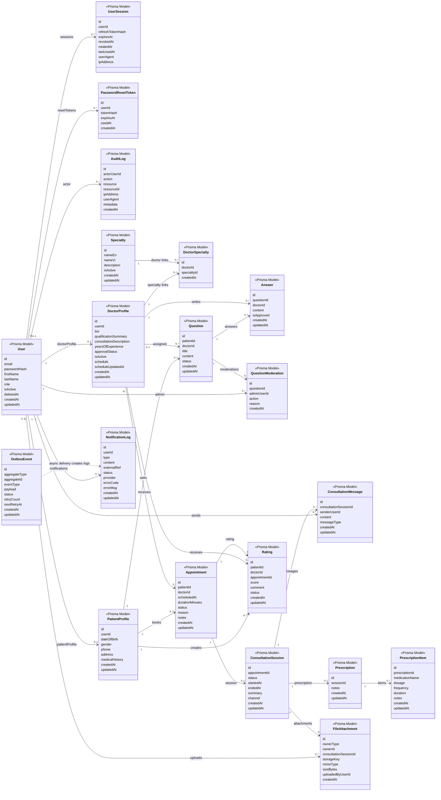

# Backend Class Diagram

Tài liệu này mô tả class diagram của backend NestJS hiện tại trong project Online Health Consultation. Nội dung được đối chiếu từ source code cuối cùng, tập trung vào các class thật đang triển khai: controller, service, gateway, scheduler, guard, provider và các Prisma model quan trọng.

Tài liệu này không dùng boundary/module box trong diagram. Backend vẫn là một modular monolith, nhưng class diagram dưới đây ưu tiên quan hệ giữa các class thay vì vẽ lại kiến trúc module.

Nguồn đã kiểm tra:

- `src/app.module.ts`
- `src/modules/**/*.controller.ts`
- `src/modules/**/*.service.ts`
- `src/modules/**/*.gateway.ts`
- `src/modules/**/*.scheduler.ts`
- `src/modules/notification/providers/*.ts`
- `src/common/guards/*.ts`
- `src/modules/identity/strategies/jwt.strategy.ts`
- `src/prisma/prisma.service.ts`
- `prisma/schema.prisma`

## Application Class Diagram

```mermaid
classDiagram
  direction LR

  class AuthController {
    <<Controller>>
    +register()
    +login()
    +refresh()
    +forgotPassword()
    +resetPassword()
    +logout()
    +getMe()
    +getUserById()
    +deactivateUser()
  }

  class AdminUserController {
    <<Controller>>
    +listUsers()
    +createUser()
    +getUserDetail()
    +updateUser()
    +updateUserStatus()
    +deleteUser()
  }

  class AuthService {
    <<Service>>
    +login()
    +refresh()
    +logout()
    +forgotPassword()
    +resetPassword()
    -issueSessionTokens()
    -createAuditLog()
  }

  class UsersService {
    <<Service>>
    +createUser()
    +createUserByAdmin()
    +findByEmail()
    +findById()
    +getUserDetailForAdmin()
    +deactivateUser()
    +listUsers()
    +updateUserStatus()
    +updateUserByAdmin()
    +deleteUserByAdmin()
  }

  class JwtStrategy {
    <<Strategy>>
    +validate()
  }

  class JwtAuthGuard {
    <<Guard>>
  }

  class RolesGuard {
    <<Guard>>
    +canActivate()
  }

  class OwnershipGuard {
    <<Guard>>
    +canActivate()
  }

  class DoctorController {
    <<Controller>>
    +getMyProfile()
    +updateMyProfile()
    +updateMySchedule()
    +updateMySpecialties()
    +listMyPatients()
    +listDoctorsForAdmin()
    +updateDoctorApproval()
    +updateDoctorProfileForAdmin()
    +updateDoctorSpecialtiesForAdmin()
  }

  class DoctorService {
    <<Service>>
    +getMyProfile()
    +updateMyProfile()
    +updateMySchedule()
    +updateMySpecialties()
    +listMyPatients()
    +listDoctorsForAdmin()
    +updateDoctorApproval()
    +updateDoctorProfileForAdmin()
    +updateDoctorSpecialtiesForAdmin()
    -replaceDoctorSpecialties()
  }

  class PatientController {
    <<Controller>>
    +getMyProfile()
    +updateMyProfile()
  }

  class PatientService {
    <<Service>>
    +getMyProfile()
    +updateMyProfile()
  }

  class DiscoveryController {
    <<Controller>>
    +getHome()
    +listSpecialties()
    +listDoctors()
    +getDoctorDetail()
  }

  class DiscoveryService {
    <<Service>>
    +getHome()
    +listPublicSpecialties()
    +listPublicDoctors()
    +getPublicDoctorById()
    -getDoctorRatingSummary()
  }

  class SpecialtyController {
    <<Controller>>
    +create()
    +listAll()
    +update()
    +deactivate()
  }

  class SpecialtyService {
    <<Service>>
    +create()
    +listAll()
    +listPublic()
    +update()
    +deactivate()
  }

  class PublicDoctorAvailabilityController {
    <<Controller>>
    +getDoctorAvailability()
  }

  class AppointmentController {
    <<Controller>>
    +createAppointment()
    +listMyAppointments()
    +cancelAppointment()
    +listDoctorAppointments()
    +getAppointmentDetail()
    +confirmAppointment()
    +completeAppointment()
    +rescheduleAppointment()
  }

  class AdminAppointmentController {
    <<Controller>>
    +listAllAppointments()
    +adminUpdateAppointmentStatus()
  }

  class AppointmentService {
    <<Service>>
    +getDoctorAvailability()
    +createAppointment()
    +listMyAppointments()
    +cancelAppointment()
    +listDoctorAppointments()
    +getAppointmentDetail()
    +confirmAppointment()
    +completeAppointment()
    +rescheduleAppointment()
    +listAllAppointments()
    +adminUpdateAppointmentStatus()
    -assertNoAppointmentOverlap()
  }

  class QuestionController {
    <<Controller>>
    +createQuestion()
    +listMyQuestions()
    +listDoctorQuestions()
    +answerQuestion()
  }

  class AdminQuestionController {
    <<Controller>>
    +moderateQuestion()
  }

  class QuestionService {
    <<Service>>
    +createQuestion()
    +listMyQuestions()
    +listDoctorQuestions()
    +answerQuestion()
    +moderateQuestion()
  }

  class ConsultationController {
    <<Controller>>
    +startSession()
    +joinSession()
    +listMessages()
    +sendMessage()
    +endSession()
    +updateSummary()
    +createPrescription()
    +getConsultationResult()
    +listMyConsultations()
    +listDoctorConsultations()
  }

  class RatingController {
    <<Controller>>
    +createRating()
    +listMyRatings()
    +listDoctorRatings()
  }

  class AdminRatingController {
    <<Controller>>
    +moderateRating()
  }

  class ConsultationGateway {
    <<Gateway>>
    +handleConnection()
    +joinRoom()
    +sendMessage()
  }

  class ConsultationService {
    <<Service>>
    +startSession()
    +joinSession()
    +listSessionMessages()
    +sendSessionMessage()
    +endSession()
    +updateSummary()
    +createPrescription()
    +createRating()
    +listMyRatings()
    +listDoctorRatings()
    +getConsultationResult()
    +listMyConsultations()
    +listDoctorConsultations()
    +moderateRating()
    -assertAppointmentAccess()
  }

  class NotificationController {
    <<Controller>>
    +listMyNotifications()
  }

  class AdminNotificationController {
    <<Controller>>
    +listAllNotificationLogs()
    +processOutbox()
    +sendAppointmentReminders()
  }

  class NotificationScheduler {
    <<Scheduler>>
    +onModuleInit()
    +onModuleDestroy()
  }

  class NotificationService {
    <<Service>>
    +listMyNotifications()
    +listAllNotificationLogs()
    +processOutboxBatch()
    +sendAppointmentReminders()
    +createPasswordResetNotification()
    -dispatchOutboxEvent()
    -createNotificationIdempotent()
  }

  class NotificationProvider {
    <<interface>>
    +supports()
    +send()
  }

  class DevelopmentNotificationProvider {
    <<Provider>>
    +supports()
    +send()
  }

  class EmailNotificationProvider {
    <<Provider>>
    +supports()
    +send()
  }

  class SmsNotificationProvider {
    <<Provider>>
    +supports()
    +send()
  }

  class ReportingController {
    <<Controller>>
    +getDashboard()
    +getConsultationTrend()
  }

  class ReportingService {
    <<Service>>
    +getDashboard()
    +getConsultationTrend()
  }

  class OperationsController {
    <<Controller>>
    +healthCheck()
  }

  class AdminOperationsController {
    <<Controller>>
    +getMetrics()
  }

  class OperationsService {
    <<Service>>
    +healthCheck()
    +getMetrics()
  }

  class ModerationController {
    <<Controller>>
    +listItems()
    +moderateItem()
  }

  class ModerationService {
    <<Service>>
    +listItems()
    +moderateItem()
    -listQuestions()
    -listAnswers()
    -listRatings()
    -moderateQuestion()
    -moderateAnswer()
    -moderateRating()
  }

  class PrismaService {
    <<PrismaService>>
    +onModuleInit()
  }

  class User {
    <<Domain Model>>
    id
    role
  }

  class OutboxEvent {
    <<Domain Model>>
    aggregateType
    eventType
    status
  }

  class NotificationLog {
    <<Domain Model>>
    type
    status
    provider
  }

  AuthController --> AuthService : delegates
  AuthController --> UsersService : user lookup/admin action
  AdminUserController --> UsersService : delegates
  AuthService --> UsersService : validates user
  AuthService --> NotificationService : password reset notification
  AuthService --> PrismaService : sessions/reset/audit
  UsersService --> PrismaService : user/profile/audit

  JwtAuthGuard --> JwtStrategy : passport jwt
  RolesGuard ..> User : checks role
  OwnershipGuard ..> User : checks owner

  DoctorController --> DoctorService : delegates
  PatientController --> PatientService : delegates
  DiscoveryController --> DiscoveryService : delegates
  SpecialtyController --> SpecialtyService : delegates

  PublicDoctorAvailabilityController --> AppointmentService : delegates
  AppointmentController --> AppointmentService : delegates
  AdminAppointmentController --> AppointmentService : delegates

  QuestionController --> QuestionService : delegates
  AdminQuestionController --> QuestionService : delegates

  ConsultationController --> ConsultationService : delegates
  RatingController --> ConsultationService : delegates
  AdminRatingController --> ConsultationService : delegates
  ConsultationGateway --> ConsultationService : realtime delegation

  NotificationController --> NotificationService : delegates
  AdminNotificationController --> NotificationService : delegates
  NotificationScheduler --> NotificationService : cron jobs
  NotificationService --> NotificationProvider : selects provider
  DevelopmentNotificationProvider ..|> NotificationProvider
  EmailNotificationProvider ..|> NotificationProvider
  SmsNotificationProvider ..|> NotificationProvider

  ReportingController --> ReportingService : delegates
  OperationsController --> OperationsService : delegates
  AdminOperationsController --> OperationsService : delegates
  ModerationController --> ModerationService : delegates

  DoctorService --> PrismaService : persistence
  PatientService --> PrismaService : persistence
  DiscoveryService --> PrismaService : query
  SpecialtyService --> PrismaService : persistence
  AppointmentService --> PrismaService : persistence
  QuestionService --> PrismaService : persistence
  ConsultationService --> PrismaService : persistence
  NotificationService --> PrismaService : outbox/logs
  ReportingService --> PrismaService : reporting query
  OperationsService --> PrismaService : health/metrics
  ModerationService --> PrismaService : moderation

  AppointmentService ..> OutboxEvent : creates appointment events
  QuestionService ..> OutboxEvent : creates answer event
  NotificationService ..> NotificationLog : writes delivery log
```

## Domain Model Class Diagram

## Diễn Giải

### Lớp ứng dụng NestJS

Các controller chỉ nhận request, kiểm tra guard/decorator ở tầng NestJS và delegate sang service tương ứng. Business logic chính nằm trong service. Những class như DTO, mapper, decorator và helper không được đưa vào diagram để giữ diagram đúng mục đích class-level.

`AuthController` và `AdminUserController` dùng `AuthService`/`UsersService` cho authentication, session, password reset và quản trị user. `JwtStrategy`, `JwtAuthGuard`, `RolesGuard`, `OwnershipGuard` là các class hỗ trợ xác thực/phân quyền, được áp dụng bằng decorator thay vì gọi trực tiếp trong business service.

`ConsultationGateway` là gateway Socket.IO thật của hệ thống. Gateway xử lý kết nối realtime và chuyển thao tác join/message sang `ConsultationService`; không có realtime service riêng nằm giữa gateway và service.

`NotificationScheduler` chạy trong cùng NestJS process bằng `node-cron`, gọi `NotificationService` để xử lý outbox và reminder. `NotificationService` dùng `NotificationProvider` interface, với ba implementation hiện có: development, email và SMS.

### Quan hệ dữ liệu/domain

Các Prisma model thể hiện domain chính của hệ thống:

- Identity: `User`, `UserSession`, `PasswordResetToken`, `AuditLog`.
- Hồ sơ: `PatientProfile`, `DoctorProfile`.
- Discovery/chuyên khoa: `Specialty`, `DoctorSpecialty`.
- Hỏi đáp sức khỏe: `Question`, `Answer`, `QuestionModeration`.
- Lịch hẹn: `Appointment`.
- Tư vấn: `ConsultationSession`, `ConsultationMessage`, `FileAttachment`.
- Đơn thuốc: `Prescription`, `PrescriptionItem`.
- Đánh giá: `Rating`.
- Thông báo bất đồng bộ: `OutboxEvent`, `NotificationLog`.

`OutboxEvent` không có foreign key vật lý đến aggregate vì nó dùng `aggregateType` và `aggregateId` để tham chiếu logic. Quan hệ từ `OutboxEvent` sang `NotificationLog` trong diagram là quan hệ xử lý bất đồng bộ, không phải quan hệ FK trong database.

## Ghi Chú Thiết Kế

- Backend là NestJS modular monolith, không phải microservices.
- `PrismaService` là điểm truy cập PostgreSQL chung cho các service nghiệp vụ.
- `Prescription` và `Rating` được triển khai trong `ConsultationModule`, không có module service riêng tên `PrescriptionService` hoặc `RatingService`.
- Admin capability được đặt trong các controller hiện hữu như `AdminUserController`, `AdminAppointmentController`, `AdminQuestionController`, `AdminRatingController`, `AdminNotificationController`, `AdminOperationsController`; không có `AdminModule` riêng.
- Diagram cố ý không mô tả các provider bên ngoài cụ thể nếu source code chưa triển khai vendor integration cụ thể.
