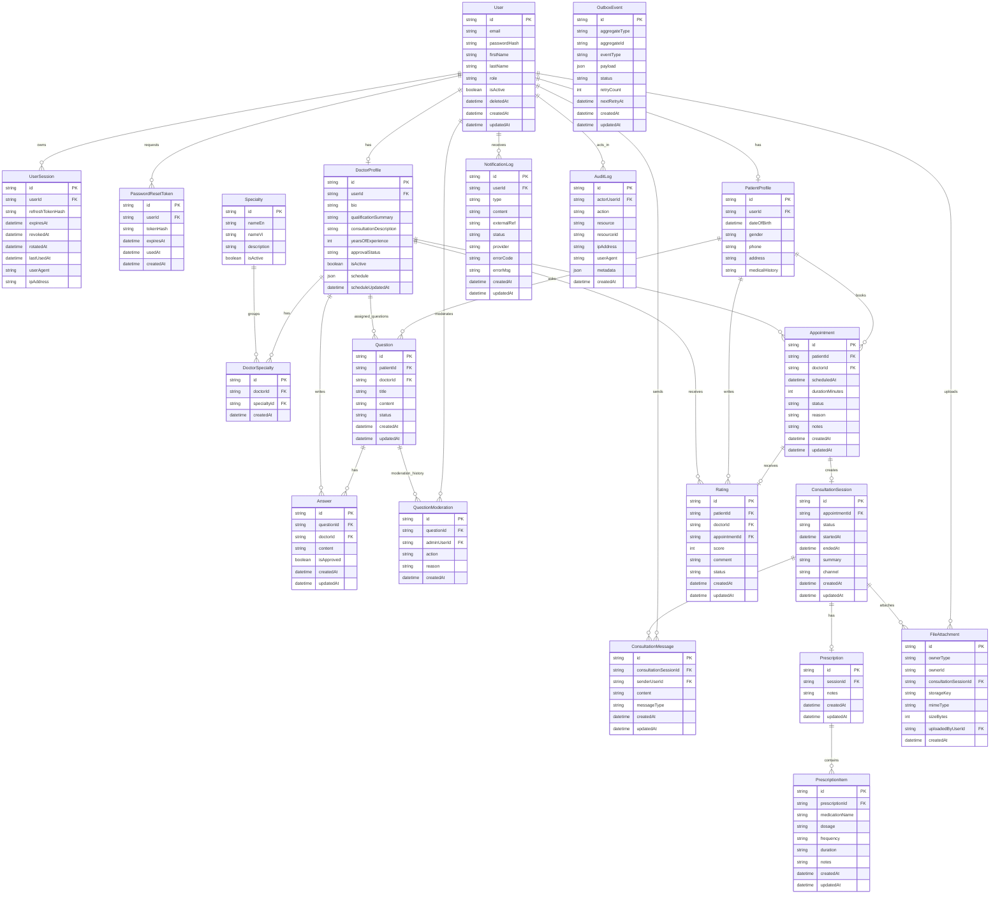

# Database ERD

Tài liệu này mô tả database thực tế của Online Health Consultation dựa trên source cuối cùng trong `prisma/schema.prisma` và các migration trong `prisma/migrations`. Không có bảng nào được thêm vào tài liệu nếu không tồn tại trong Prisma schema/migration.

Nguồn đã kiểm tra:

- `prisma/schema.prisma`
- `prisma/migrations/20260418065106_init_postgres/migration.sql`
- `prisma/migrations/20260418150000_add_consultation_messages/migration.sql`
- `prisma/migrations/20260418162000_add_notification_external_ref/migration.sql`
- `prisma/migrations/20260820043000_add_doctor_professional_profile_fields/migration.sql`

## Tổng Quan

Database hiện tại là PostgreSQL, được truy cập qua Prisma ORM. Schema dùng UUID string cho primary key của các domain table chính. Một số enum quan trọng được lưu trong PostgreSQL enum:

- `Role`: `PATIENT`, `DOCTOR`, `ADMIN`
- `Gender`: `MALE`, `FEMALE`, `OTHER`
- `QuestionStatus`: `PENDING`, `ANSWERED`, `CLOSED`, `MODERATED`
- `AppointmentStatus`: `PENDING_CONFIRMATION`, `CONFIRMED`, `COMPLETED`, `CANCELLED`, `NO_SHOW`
- `ConsultationStatus`: `SCHEDULED`, `ONGOING`, `COMPLETED`, `CANCELLED`
- `NotificationType`: `EMAIL`, `SMS`
- `NotificationStatus`: `PENDING`, `SENT`, `FAILED`
- `RatingStatus`: `VISIBLE`, `HIDDEN`
- `ApprovalStatus`: `PENDING`, `APPROVED`, `REJECTED`
- `OutboxStatus`: `PENDING`, `PROCESSING`, `SENT`, `FAILED`

## ERD Export Placeholder

> TODO: Chèn ERD được export trực tiếp từ database/Prisma tool sau khi mở schema thực tế.
>
> Placeholder đề xuất:
>
> ```md
> 
> ```
>
> Không dùng bản vẽ thủ công ở đây để tránh sai lệch so với quan hệ thực tế trong database.

## Mermaid ER Diagram



Ghi chú: `OutboxEvent` không có foreign key vật lý đến aggregate table. Nó lưu `aggregateType` và `aggregateId` để liên kết logic với domain event.

## Entity Chi Tiết

### User

- Table: `users`
- Primary key: `id`
- Unique: `email`
- Field quan trọng: `passwordHash`, `firstName`, `lastName`, `role`, `isActive`, `deletedAt`, `createdAt`, `updatedAt`.
- Quan hệ:
  - 1 `User` có 0 hoặc 1 `PatientProfile`.
  - 1 `User` có 0 hoặc 1 `DoctorProfile`.
  - 1 `User` có nhiều `UserSession`, `PasswordResetToken`, `NotificationLog`, `ConsultationMessage`.
  - 1 `User` có thể là actor của nhiều `AuditLog`.
  - 1 admin `User` có thể tạo nhiều `QuestionModeration`.
  - 1 `User` có thể upload nhiều `FileAttachment`.

### UserSession

- Table: `user_sessions`
- Primary key: `id`
- Foreign key: `userId -> users.id`, `onDelete: Cascade`.
- Unique: `refreshTokenHash`.
- Field quan trọng: `expiresAt`, `revokedAt`, `rotatedAt`, `lastUsedAt`, `userAgent`, `ipAddress`.
- Cardinality: nhiều session thuộc về 1 `User`.

### PasswordResetToken

- Table: `password_reset_tokens`
- Primary key: `id`
- Foreign key: `userId -> users.id`, `onDelete: Cascade`.
- Unique: `tokenHash`.
- Field quan trọng: `expiresAt`, `usedAt`, `createdAt`.
- Cardinality: nhiều reset token thuộc về 1 `User`.

### PatientProfile

- Table: `patient_profiles`
- Primary key: `id`
- Foreign key: `userId -> users.id`, `onDelete: Cascade`.
- Unique: `userId`.
- Field quan trọng: `dateOfBirth`, `gender`, `phone`, `address`, `medicalHistory`.
- Quan hệ:
  - 1 `PatientProfile` thuộc về đúng 1 `User`.
  - 1 `PatientProfile` có nhiều `Question`.
  - 1 `PatientProfile` có nhiều `Appointment`.
  - 1 `PatientProfile` có nhiều `Rating`.

### DoctorProfile

- Table: `doctor_profiles`
- Primary key: `id`
- Foreign key: `userId -> users.id`, `onDelete: Cascade`.
- Unique: `userId`.
- Field quan trọng: `bio`, `qualificationSummary`, `consultationDescription`, `yearsOfExperience`, `approvalStatus`, `isActive`, `schedule`, `scheduleUpdatedAt`.
- Quan hệ:
  - 1 `DoctorProfile` thuộc về đúng 1 `User`.
  - 1 `DoctorProfile` có nhiều `DoctorSpecialty`.
  - 1 `DoctorProfile` có nhiều `Question` được gán, nhiều `Answer`, nhiều `Appointment`, nhiều `Rating`.

### Specialty

- Table: `specialties`
- Primary key: `id`
- Unique: `nameEn`.
- Field quan trọng: `nameEn`, `nameVi`, `description`, `isActive`.
- Quan hệ: 1 `Specialty` có nhiều `DoctorSpecialty`.

### DoctorSpecialty

- Table: `doctor_specialties`
- Primary key: `id`
- Foreign keys:
  - `doctorId -> doctor_profiles.id`, `onDelete: Cascade`.
  - `specialtyId -> specialties.id`, `onDelete: Restrict`.
- Unique: `(doctorId, specialtyId)`.
- Field quan trọng: `createdAt`.
- Cardinality: bảng nối many-to-many giữa `DoctorProfile` và `Specialty`.

### Question

- Table: `questions`
- Primary key: `id`
- Foreign keys:
  - `patientId -> patient_profiles.id`, `onDelete: Cascade`.
  - `doctorId -> doctor_profiles.id`, nullable, `onDelete: SetNull`.
- Field quan trọng: `title`, `content`, `status`, `createdAt`, `updatedAt`.
- Quan hệ:
  - 1 `Question` luôn thuộc về 1 `PatientProfile`.
  - 1 `Question` có thể được gán cho 0 hoặc 1 `DoctorProfile`.
  - 1 `Question` có nhiều `Answer`.
  - 1 `Question` có nhiều `QuestionModeration`.

### Answer

- Table: `answers`
- Primary key: `id`
- Foreign keys:
  - `questionId -> questions.id`, `onDelete: Cascade`.
  - `doctorId -> doctor_profiles.id`, `onDelete: Restrict`.
- Field quan trọng: `content`, `isApproved`, `createdAt`, `updatedAt`.
- Cardinality: nhiều `Answer` thuộc về 1 `Question`; nhiều `Answer` được viết bởi 1 `DoctorProfile`.

### QuestionModeration

- Table: `question_moderations`
- Primary key: `id`
- Foreign keys:
  - `questionId -> questions.id`, `onDelete: Cascade`.
  - `adminUserId -> users.id`, `onDelete: Restrict`.
- Field quan trọng: `action`, `reason`, `createdAt`.
- Cardinality: nhiều moderation event thuộc về 1 `Question`; mỗi event do 1 admin `User` thực hiện.

### Appointment

- Table: `appointments`
- Primary key: `id`
- Foreign keys:
  - `patientId -> patient_profiles.id`, `onDelete: Cascade`.
  - `doctorId -> doctor_profiles.id`, `onDelete: Restrict`.
- Field quan trọng: `scheduledAt`, `durationMinutes`, `status`, `reason`, `notes`, `createdAt`, `updatedAt`.
- Quan hệ:
  - nhiều `Appointment` thuộc về 1 `PatientProfile`.
  - nhiều `Appointment` thuộc về 1 `DoctorProfile`.
  - 1 `Appointment` có 0 hoặc 1 `ConsultationSession`.
  - 1 `Appointment` có 0 hoặc 1 `Rating`.

### ConsultationSession

- Table: `consultation_sessions`
- Primary key: `id`
- Foreign key: `appointmentId -> appointments.id`, `onDelete: Cascade`.
- Unique: `appointmentId`.
- Field quan trọng: `status`, `startedAt`, `endedAt`, `summary`, `channel`, `createdAt`, `updatedAt`.
- Quan hệ:
  - 1 `ConsultationSession` thuộc về đúng 1 `Appointment`.
  - 1 `ConsultationSession` có nhiều `ConsultationMessage`.
  - 1 `ConsultationSession` có 0 hoặc 1 `Prescription`.
  - 1 `ConsultationSession` có nhiều `FileAttachment`.

### ConsultationMessage

- Table: `consultation_messages`
- Primary key: `id`
- Foreign keys:
  - `consultationSessionId -> consultation_sessions.id`, `onDelete: Cascade`.
  - `senderUserId -> users.id`, `onDelete: Cascade`.
- Field quan trọng: `content`, `messageType`, `createdAt`, `updatedAt`.
- Cardinality: nhiều message thuộc về 1 consultation session; nhiều message được gửi bởi 1 user.

### Prescription

- Table: `prescriptions`
- Primary key: `id`
- Foreign key: `sessionId -> consultation_sessions.id`, `onDelete: Cascade`.
- Unique: `sessionId`.
- Field quan trọng: `notes`, `createdAt`, `updatedAt`.
- Quan hệ: 1 `Prescription` thuộc về đúng 1 `ConsultationSession` và có nhiều `PrescriptionItem`.

### PrescriptionItem

- Table: `prescription_items`
- Primary key: `id`
- Foreign key: `prescriptionId -> prescriptions.id`, `onDelete: Cascade`.
- Field quan trọng: `medicationName`, `dosage`, `frequency`, `duration`, `notes`, `createdAt`, `updatedAt`.
- Cardinality: nhiều item thuộc về 1 prescription.

### Rating

- Table: `ratings`
- Primary key: `id`
- Foreign keys:
  - `patientId -> patient_profiles.id`, `onDelete: Cascade`.
  - `doctorId -> doctor_profiles.id`, `onDelete: Restrict`.
  - `appointmentId -> appointments.id`, `onDelete: Cascade`.
- Unique: `appointmentId`.
- Field quan trọng: `score`, `comment`, `status`, `createdAt`, `updatedAt`.
- Quan hệ:
  - 1 appointment có tối đa 1 rating.
  - nhiều rating được viết bởi 1 patient.
  - nhiều rating thuộc về 1 doctor.

### NotificationLog

- Table: `notification_logs`
- Primary key: `id`
- Foreign key: `userId -> users.id`, `onDelete: Cascade`.
- Unique: `externalRef`.
- Field quan trọng: `type`, `content`, `status`, `provider`, `errorCode`, `errorMsg`, `createdAt`, `updatedAt`.
- Cardinality: nhiều notification log thuộc về 1 user.

### OutboxEvent

- Table: `outbox_events`
- Primary key: `id`
- Không có foreign key vật lý.
- Field quan trọng: `aggregateType`, `aggregateId`, `eventType`, `payload`, `status`, `retryCount`, `nextRetryAt`, `createdAt`, `updatedAt`.
- Quan hệ logic: `aggregateType` và `aggregateId` trỏ logic đến aggregate phát sinh event, ví dụ appointment hoặc notification workflow. Database không enforce quan hệ này bằng FK.

### AuditLog

- Table: `audit_logs`
- Primary key: `id`
- Foreign key: `actorUserId -> users.id`, nullable, `onDelete: SetNull`.
- Field quan trọng: `action`, `resource`, `resourceId`, `ipAddress`, `userAgent`, `metadata`, `createdAt`.
- Cardinality: nhiều audit log có thể thuộc về 1 actor user; log vẫn được giữ lại nếu user bị xóa.

### FileAttachment

- Table: `file_attachments`
- Primary key: `id`
- Foreign keys:
  - `uploadedByUserId -> users.id`, nullable, `onDelete: SetNull`.
  - `consultationSessionId -> consultation_sessions.id`, nullable, `onDelete: Cascade`.
- Field quan trọng: `ownerType`, `ownerId`, `storageKey`, `mimeType`, `sizeBytes`, `createdAt`.
- Quan hệ:
  - nhiều file có thể được upload bởi 1 user.
  - nhiều file có thể gắn trực tiếp với 1 consultation session.
  - `ownerType` và `ownerId` là polymorphic owner fields, không được database enforce bằng FK.

## Giải Thích Theo Bounded/Domain Area

### Identity

Identity xoay quanh `User`, `UserSession` và `PasswordResetToken`.

- `User` lưu credential hash, thông tin định danh cơ bản, role và trạng thái active/soft delete.
- `UserSession` lưu refresh token hash, thời hạn, trạng thái revoke/rotate và metadata request như user agent/IP.
- `PasswordResetToken` lưu token hash cho forgot/reset password, có thời hạn và `usedAt`.

Thiết kế này tách session/token khỏi user account để một user có thể có nhiều phiên và nhiều reset token theo thời gian.

### Profiles

Profiles tách thông tin theo vai trò nghiệp vụ:

- `PatientProfile` mở rộng `User` role patient với thông tin cá nhân/y tế như ngày sinh, giới tính, phone, address và medical history.
- `DoctorProfile` mở rộng `User` role doctor với bio, qualification summary, consultation description, years of experience, approval status, active flag và schedule JSON.

Quan hệ `User -> PatientProfile` và `User -> DoctorProfile` là one-to-zero-or-one qua unique `userId`.

### Discovery

Discovery dựa trên `DoctorProfile`, `Specialty` và `DoctorSpecialty`.

- `Specialty` lưu chuyên khoa public/admin quản lý.
- `DoctorSpecialty` là join table many-to-many giữa doctor và specialty.
- `DoctorProfile.approvalStatus`, `DoctorProfile.isActive` và `Specialty.isActive` là các field chính để filter discovery bác sĩ/chuyên khoa đang hiển thị.

### Questions

Questions gồm `Question`, `Answer` và `QuestionModeration`.

- Patient tạo `Question`; doctor assignment là optional qua nullable `doctorId`.
- Doctor tạo `Answer` cho question, có flag `isApproved`.
- Admin moderation được lưu thành lịch sử trong `QuestionModeration`, không ghi đè mất dấu event.

Cardinality chính: 1 patient có nhiều question; 1 question có nhiều answer và nhiều moderation event.

### Appointments

Appointments được mô hình bằng `Appointment`.

- Mỗi appointment liên kết 1 patient profile và 1 doctor profile.
- Các field nghiệp vụ chính là `scheduledAt`, `durationMinutes`, `status`, `reason`, `notes`.
- Index theo doctor/date, patient/date và status/date hỗ trợ list/filter lịch hẹn.

Appointment là điểm nối sang consultation và feedback: 1 appointment có tối đa 1 consultation session và tối đa 1 rating.

### Consultation

Consultation gồm `ConsultationSession`, `ConsultationMessage` và một phần `FileAttachment`.

- `ConsultationSession` có quan hệ one-to-one với `Appointment` qua unique `appointmentId`.
- `ConsultationMessage` lưu message realtime/persisted chat, liên kết session và sender user.
- `FileAttachment` có thể liên kết consultation session bằng FK và đồng thời có polymorphic owner fields `ownerType`, `ownerId`.

Session lifecycle được phản ánh bằng `status`, `startedAt`, `endedAt`, `summary` và `channel`.

### Prescription

Prescription gồm `Prescription` và `PrescriptionItem`.

- 1 `ConsultationSession` có tối đa 1 `Prescription`.
- 1 `Prescription` có nhiều `PrescriptionItem`.
- `PrescriptionItem` lưu medication name, dosage, frequency, duration và notes.

Thiết kế này giữ prescription như kết quả của consultation thay vì gắn trực tiếp vào appointment.

### Feedback

Feedback được lưu trong `Rating`.

- 1 `Rating` liên kết patient, doctor và appointment.
- Unique `appointmentId` đảm bảo mỗi appointment chỉ có tối đa 1 rating.
- `status` cho phép admin/logic nghiệp vụ ẩn rating mà không xóa dữ liệu.

### Notification

Notification gồm `NotificationLog` và `OutboxEvent`.

- `NotificationLog` lưu lịch sử notification theo user, type, content, provider/status/error metadata và `externalRef`.
- `OutboxEvent` lưu event cần xử lý async với payload JSON, retry count, next retry time và status.

`OutboxEvent` không có FK vì nó là outbox tổng quát theo aggregate type/id. Đây là boundary persistence cho background notification processing hiện tại.

### Audit

Audit gồm `AuditLog` và một phần user actor relation.

- `AuditLog` lưu actor user optional, action, resource, resourceId, request metadata và JSON metadata.
- `actorUserId` dùng `onDelete: SetNull` để vẫn giữ audit trail khi user bị xóa.
- Index `(resource, resourceId)` hỗ trợ truy vết lịch sử theo object nghiệp vụ.

## Ghi Chú Về Quan Hệ Polymorphic Và Logical Reference

Hai pattern không được enforce bằng foreign key vật lý:

- `FileAttachment.ownerType` + `ownerId`: cho phép file thuộc nhiều loại owner khác nhau, đồng thời vẫn có FK optional đến `ConsultationSession` cho use case consultation.
- `OutboxEvent.aggregateType` + `aggregateId`: cho phép outbox lưu event cho nhiều aggregate khác nhau mà không cần bảng outbox riêng cho từng domain.

Các quan hệ này cần được kiểm soát ở tầng service/application vì PostgreSQL không enforce referential integrity trực tiếp cho chúng.
