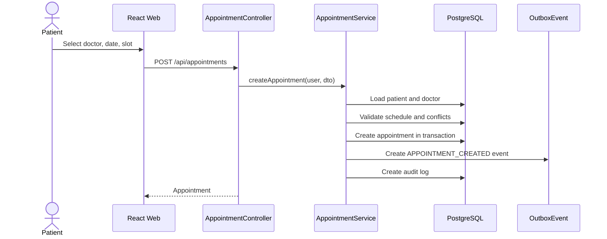
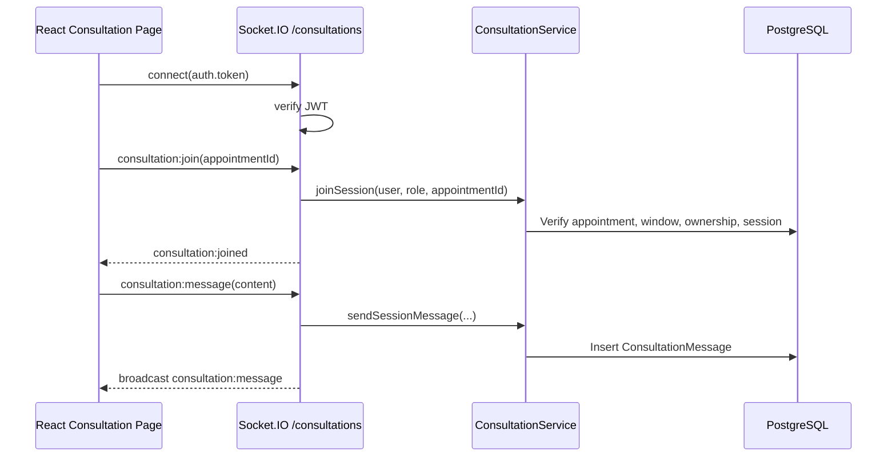
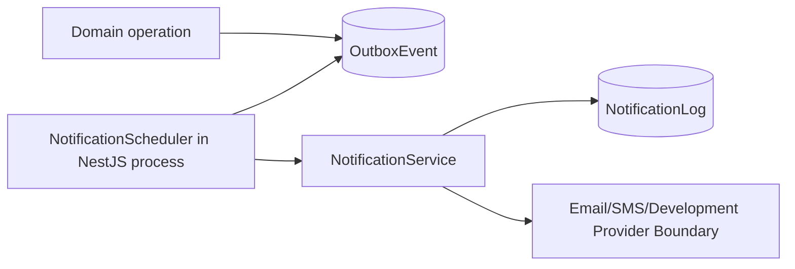

# Kiến Trúc Hệ Thống

Tài liệu này mô tả kiến trúc thực tế đang tồn tại trong source code hiện tại của Online Health Consultation. Source code là source of truth cuối cùng; Graphify graph/report được dùng để hỗ trợ kiểm tra module, dependency, gateway, scheduler và quan hệ frontend/backend trước khi cập nhật nội dung.

## Architecture Overview

Kiến trúc hiện tại là một web application gồm React SPA, một NestJS application theo kiểu modular monolith, Prisma ORM và PostgreSQL.

High-level architecture hiện tại:

- Users: Guest, Patient, Doctor, Administrator.
- Web Client: React SPA được build bằng Vite và có thể deploy như static frontend.
- Frontend Hosting: cấu hình hiện có là Vercel SPA rewrite qua `OnlineHealthConsultation-Web/vercel.json`.
- Application Layer: một NestJS application duy nhất, expose REST API và Socket.IO realtime entry.
- API Entry: NestJS controllers nhận HTTP requests dưới global prefix `/api`.
- Realtime Entry: `ConsultationGateway` expose Socket.IO namespace `/consultations`.
- Application Modules: các NestJS modules được register trong `AppModule`.
- Background Jobs: `NotificationScheduler` chạy trong NestJS application process bằng `node-cron`.
- Backend Hosting: cấu hình hiện có là Railway qua `OnlineHealthConsultation-Service/railway.json`.
- Data Layer: application modules dùng `PrismaService` / Prisma ORM để truy cập PostgreSQL.
- External Services: email/SMS/video hiện là provider/integration boundary; source hiện tại chưa có vendor integration cụ thể.

### Architecture Overview Diagram

> Architecture Overview Diagram will be inserted here.

## Users

Guest xem nội dung công khai như home, specialties, danh sách bác sĩ và hồ sơ bác sĩ đã được duyệt.

Patient đăng ký/đăng nhập, quản lý hồ sơ sức khỏe, gửi câu hỏi, đặt lịch hẹn, tham gia consultation, xem kết quả/prescription và đánh giá bác sĩ.

Doctor quản lý hồ sơ chuyên môn, lịch làm việc, chuyên khoa, trả lời câu hỏi, xử lý appointment lifecycle, tham gia consultation, ghi summary/prescription và xem ratings.

Administrator quản lý users, doctors, patients, specialties, appointments, moderation, notifications, operational metrics và reporting.

## Web Client

Frontend nằm trong `OnlineHealthConsultation-Web` và là React TypeScript SPA chạy trên Vite. Graphify report ghi nhận các community/hub như `routes.tsx`, `store.ts`, `rootSaga.ts`, `auth.api.ts`, `patient.api.ts`, `admin.api.ts`, `reports.api.ts` và `ConsultationSocketClient`, phù hợp với organization thực tế trong source.

Các điểm kiến trúc chính:

- Routing nằm trong `src/app/routes.tsx`, dùng React Router và lazy-loaded pages.
- `AuthGuard` bảo vệ vùng route cần đăng nhập; `RoleGuard` điều hướng user sai role sang forbidden page.
- State management dùng Redux Toolkit slices và Redux Saga. `src/state/store.ts` cấu hình store, gắn saga middleware và chạy `rootSaga`.
- Async workflows được chia theo feature sagas: auth, patient, doctor, admin và reports.
- REST communication đi qua feature API modules và shared Axios `apiClient`.
- `apiClient` dùng `VITE_API_BASE_URL` hoặc default config, thêm `/api`, bật `withCredentials`, gắn bearer token và thực hiện single-flight refresh khi phù hợp.
- Realtime consultation chat dùng `socket.io-client` qua `ConsultationSocketClient` và `useConsultationSocket`.

Frontend feature organization hiện tại:

- `features/auth`: login, register, forgot/reset password, current-user bootstrap.
- `features/public`: public specialties, doctor list, doctor detail.
- `features/patient`: patient profile, questions, appointment booking, consultation history, consultation session, ratings.
- `features/doctor`: doctor profile, schedule, questions, appointments, patients, ratings, consultation session.
- `features/admin`: users, patients, doctors, specialties, appointments, moderation.
- `features/reports`: admin dashboard metrics và consultation trend.
- `features/consultation/realtime`: Socket.IO client wrapper và hook.

## Application Layer

Backend nằm trong `OnlineHealthConsultation-Service` và là một NestJS application duy nhất. `src/main.ts` gọi `NestFactory.create(AppModule)`, set global prefix `/api`, enable CORS, cấu hình global validation, global exception filter, request logging và Swagger.

Kiến trúc backend là NestJS modular monolith:

- Một runtime process cho toàn bộ backend.
- Một `AppModule` compose các business modules.
- Một shared `PrismaModule` global cung cấp `PrismaService`.
- Controllers expose REST endpoints.
- Services chứa business rules và orchestration với database.
- Không có API Gateway product/component riêng.
- Không có microservices runtime, service discovery hoặc database riêng theo module.

## Entry Points

### REST API

REST API được expose qua NestJS controllers dưới global prefix `/api`.

Các controller groups chính trong source:

- `auth`, `admin/users`.
- `public`, `public/doctors`.
- `patients`, `doctors/me`, `admin/doctors`.
- `appointments`, `admin/appointments`.
- `questions`, `admin/questions`.
- `consultations`, `ratings`, `admin/ratings`.
- `notifications`, `admin/notifications`.
- `reports`.
- `admin/specialties`, `admin/moderation`, `admin/ops`.
- `health`.

Request flow thực tế là:

```text
HTTP request
→ NestJS controller
→ guards/decorators nếu endpoint yêu cầu auth/role
→ module service
→ PrismaService / Prisma ORM
→ PostgreSQL
```

### Realtime

Realtime entry hiện tại là NestJS `ConsultationGateway`.

Implementation source xác nhận:

- Class: `ConsultationGateway`.
- Decorator: `@WebSocketGateway`.
- Namespace: `/consultations`.
- Transport runtime: Socket.IO.
- Authentication: JWT lấy từ `Authorization: Bearer ...` hoặc `handshake.auth.token`.
- Events chính: `consultation:join`, `consultation:joined`, `consultation:message`.

Đây là gateway nằm trong cùng NestJS application process, không phải standalone realtime service.

## Application Modules

Graphify và `src/app.module.ts` xác nhận các modules runtime sau đang được import vào `AppModule`.

### Identity

Quản lý authentication, JWT strategy, refresh sessions, password reset, user lookup và admin user management. Module này import `NotificationModule` để tạo password reset notification.

### Doctor

Quản lý doctor profile, schedule, specialties, patients của doctor và admin approval/profile updates.

### Patient

Quản lý patient health profile của user role `PATIENT`.

### Appointment

Quản lý doctor availability, booking, patient/doctor appointment listing, cancellation, confirmation, completion, reschedule và admin appointment management.

### Question

Quản lý patient questions, doctor answers và admin question moderation.

### Consultation

Quản lý consultation session lifecycle, persisted chat messages, consultation summary, prescription, ratings và `ConsultationGateway`.

### Notification

Quản lý notification logs, database-backed outbox processing, provider boundary và in-process scheduled reminders.

### Reporting

Cung cấp admin dashboard metrics và consultation trend data bằng Prisma queries trên operational database.

### Specialty

Quản lý specialty CRUD và activation cho admin.

### Discovery

Cung cấp public home, specialties và approved doctor discovery APIs.

### Operations

Cung cấp health endpoint và admin operational metrics.

### Moderation

Cung cấp admin moderation queue/actions cho content được hỗ trợ.

### Prisma

`PrismaModule` là global module cung cấp `PrismaService` cho application modules.

## Background Jobs

Background jobs hiện được chạy bên trong NestJS application process.

Implementation thực tế:

- `NotificationScheduler` implements `OnModuleInit` và `OnModuleDestroy`.
- Scheduler dùng `node-cron`, không dùng `ScheduleModule` của NestJS.
- Outbox cron lấy từ `NOTIFICATION_OUTBOX_CRON`, default `*/1 * * * *`.
- Reminder cron lấy từ `NOTIFICATION_REMINDER_CRON`, default `*/5 * * * *`.
- Outbox batch limit lấy từ `NOTIFICATION_OUTBOX_BATCH_LIMIT`, default `100`.
- Reminder window lấy từ `NOTIFICATION_REMINDER_WINDOW_MINUTES`, default `60`.
- Scheduler gọi `NotificationService.processOutboxBatch(...)`.
- Scheduler gọi `NotificationService.sendAppointmentReminders(...)`.

Không có worker service, message consumer hoặc background process độc lập trong source hiện tại.

## Data Layer

Data layer hiện tại là:

```text
Application Modules
→ PrismaService / Prisma ORM
→ PostgreSQL
```

`prisma/schema.prisma` xác nhận datasource provider là `postgresql` và đọc connection string từ `DATABASE_URL`. `PrismaService` extends `PrismaClient`, connect khi module init, và có Prisma middleware để sanitize audit metadata/mask IP trước khi ghi `AuditLog`.

PostgreSQL là source of truth cho persisted application data hiện tại.

Nhóm dữ liệu chính trong Prisma schema:

- Identity/session/audit: `User`, `UserSession`, `PasswordResetToken`, `AuditLog`.
- Profile/discovery: `PatientProfile`, `DoctorProfile`, `Specialty`, `DoctorSpecialty`.
- Q&A/moderation: `Question`, `Answer`, `QuestionModeration`.
- Appointment/consultation: `Appointment`, `ConsultationSession`, `ConsultationMessage`.
- Prescription/rating/attachments: `Prescription`, `PrescriptionItem`, `Rating`, `FileAttachment`.
- Notification/outbox: `NotificationLog`, `OutboxEvent`.

Không có Redis, MongoDB, Elasticsearch, cache layer, warehouse hoặc database riêng theo module trong source hiện tại.

## Xác Thực Và RBAC

Authentication dùng JWT access token và refresh token trong HttpOnly cookie.

Luồng hiện tại:

1. Login kiểm tra email/password bằng bcrypt.
2. Backend issue access token và refresh token.
3. Refresh token được hash và lưu ở `UserSession`.
4. Refresh token được set vào HttpOnly cookie.
5. Refresh endpoint verify cookie token, revoke session cũ, tạo session mới và trả access token mới.
6. Logout revoke active sessions và clear refresh cookie.

Authorization backend:

- `JwtAuthGuard` validate bearer access token qua Passport JWT.
- `RolesGuard` enforce `@Roles(...)`.
- `OwnershipGuard` enforce ownership rule ở endpoint có `@Ownership(...)`.
- Role enum hiện tại: `PATIENT`, `DOCTOR`, `ADMIN`.

Frontend guards chỉ phục vụ routing/UX; backend guards và service-level ownership checks mới là lớp bảo vệ chính.

## Phân Hệ Appointment

`AppointmentModule` quản lý availability, booking và lifecycle của appointments.

Behavior chính từ source:

- Public doctor availability dựa trên doctor schedule JSON, date, duration, slot step và appointments conflict.
- Patient tạo appointment, xem appointments của mình và cancel appointment.
- Doctor xem appointments của mình, confirm, complete và reschedule.
- Admin list appointments với pagination/status/date filters và update status.
- Booking/reschedule chỉ cho doctor active, approved và user account active.
- Conflict checks áp dụng cho doctor và patient appointments ở trạng thái `PENDING_CONFIRMATION` hoặc `CONFIRMED`.
- Critical create/reschedule operations dùng Prisma transaction với `Serializable` isolation.
- Appointment create/confirm/reschedule ghi `OutboxEvent`.
- Appointment lifecycle actions ghi `AuditLog`.



## Realtime Communication

Realtime communication hiện tại phục vụ consultation chat.

Flow thực tế:

```text
React SPA
↔ Socket.IO client
↔ ConsultationGateway
↔ ConsultationService
↔ PrismaService / PostgreSQL
```

Frontend dùng `ConsultationSocketClient` để connect tới `${VITE_API_BASE_URL}/consultations`, truyền access token qua socket auth, join room theo `appointmentId` và gửi message qua event `consultation:message`.

Backend `ConsultationGateway` verify JWT, gọi `ConsultationService.joinSession(...)` để kiểm tra appointment, role, ownership và consultation window, sau đó join room `consultation:<appointmentId>`. Khi nhận message, gateway gọi `ConsultationService.sendSessionMessage(...)`, lưu message vào `ConsultationMessage`, rồi broadcast message tới room.

Video hiện chỉ là optional integration boundary:

- `ConsultationService.startSession(...)` có logic nhận requested channel.
- Nếu `VIDEO_PROVIDER_ENABLED=true` và requested channel là `VIDEO`, session channel được set là `VIDEO`.
- Source hiện tại không có concrete third-party video provider integration.
- Nếu video provider chưa enabled, request video fallback về `CHAT`.



## Notifications and Background Processing

Notifications hiện dùng database-backed outbox và notification logs.

Flow thực tế:

```text
Domain operation
→ OutboxEvent
→ NotificationScheduler in NestJS process
→ NotificationService
→ NotificationLog
→ provider boundary
```

Domain events được ghi vào `OutboxEvent` trong cùng transaction với domain operation ở những flow đã implement, ví dụ appointment create/confirm/reschedule và question answered.

`NotificationService.processOutboxBatch(...)` scan events `PENDING` hoặc retryable `FAILED`, claim bằng trạng thái `PROCESSING`, dispatch theo `aggregateType`/`eventType`, tạo notification idempotent theo `externalRef`, rồi mark outbox event là `SENT` hoặc `FAILED`.

Event handling hiện có trong source:

- `APPOINTMENT_CREATED`: tạo notification cho patient và doctor.
- `APPOINTMENT_CONFIRMED`: tạo notification cho patient.
- `QUESTION_ANSWERED`: tạo notification cho patient.

Appointment reminders được xử lý bằng scheduler riêng trong cùng `NotificationScheduler`, scan confirmed appointments trong window cấu hình và tạo notification idempotent cho patient/doctor.



Không có message broker hoặc worker process độc lập trong implementation hiện tại.

## Reporting

`ReportingModule` expose admin-only reporting endpoints:

- `GET /api/reports/dashboard`
- `GET /api/reports/consultations/trend`

`ReportingService` đọc trực tiếp operational tables bằng Prisma để tính:

- consultation counts và status grouping;
- appointment counts và status grouping;
- user, active user, doctor, patient và specialty counts;
- question và rating counts;
- consultation trends theo day/week/month.

Không có analytics database, warehouse, BI tool hoặc materialized reporting store riêng trong source hiện tại.

## External Service Boundaries

### Email / SMS

Source hiện tại có provider abstraction cho notification delivery:

- `DevelopmentNotificationProvider`: ghi log và trả success cho email/SMS trong môi trường development.
- `EmailNotificationProvider`: dry-run abstraction, trả failure nếu `NOTIFICATION_EMAIL_PROVIDER_ENABLED` không phải `true`; không có vendor client cụ thể.
- `SmsNotificationProvider`: trả failure `SMS_PROVIDER_NOT_CONFIGURED`; không có vendor client cụ thể.

Vì vậy Email/SMS chỉ là external provider boundary trong kiến trúc hiện tại, chưa phải production vendor integration.

### Video Service

Video service hiện là optional integration boundary. Source có channel/flag/fallback trong consultation start flow, nhưng không có concrete third-party video provider integration.

### File Storage

Prisma schema có `FileAttachment`, nhưng source hiện tại không có object storage provider integration cho upload/storage. Vì vậy file storage chỉ nên xem là possible future extension, không phải current architecture component.

## Deployment Architecture

Deployment configuration hiện có:

- Frontend: Vercel SPA rewrite trong `OnlineHealthConsultation-Web/vercel.json`.
- Backend: Railway deployment config trong `OnlineHealthConsultation-Service/railway.json`.
- Database: PostgreSQL qua `DATABASE_URL`; local development dùng PostgreSQL 15 container trong `docker-compose.yml`.

Deployment flow hiện tại:

```text
Browser
→ Vercel React SPA
→ Railway NestJS Application
→ PostgreSQL
```

Railway backend config:

- Build: `npm install && npm run prisma:generate && npm run build`.
- Start: `npm run prisma:generate && npm run prisma:migrate:deploy && npm run prisma:seed && npm run start:prod`.
- Healthcheck path: `/api/health`.

Vercel frontend config:

- Rewrite mọi path về `/index.html` để hỗ trợ client-side routing.
- API base URL dùng `VITE_API_BASE_URL`.
- Socket.IO client dùng cùng base URL và namespace `/consultations`.

Không có cloud infrastructure khác được cấu hình trong source hiện tại.

## Quyết Định Kiến Trúc Và Trade-offs Chính

- Modular monolith: đơn giản hóa deployment và transaction boundary, đổi lại modules cùng chia sẻ runtime/database nên cần discipline để giữ boundary rõ.
- Single PostgreSQL database: nhất quán dữ liệu và transaction đơn giản, đổi lại reporting/background processing cùng dùng operational database.
- Prisma persistence: type-safe database access và migration workflow rõ, nhưng services phụ thuộc trực tiếp vào Prisma model shape.
- JWT/RBAC: backend enforce auth bằng `JwtAuthGuard`, `RolesGuard`, `OwnershipGuard`; frontend guards chỉ hỗ trợ UX.
- Socket.IO cho consultation chat: phù hợp realtime communication hiện tại, nhưng scale multi-instance cần sticky sessions hoặc Socket.IO adapter.
- Database-backed outbox: đảm bảo domain operation và event được ghi cùng transaction, nhưng processor hiện là in-process scheduler nên chưa tách tải khỏi web process.
- In-process scheduler: vận hành đơn giản, nhưng khi scale nhiều backend instances cần strategy tránh duplicate processing hoặc tách dedicated worker.
- Operational reporting: triển khai nhanh bằng Prisma queries trên DB hiện có, nhưng reporting nặng có thể cạnh tranh tài nguyên với transactional workload.
- Provider abstractions: code có boundary cho email/SMS/video, nhưng production provider integration chưa tồn tại trong source.

## Future Evolution

Các mục dưới đây là possible future evolution, không phải current architecture:

- Thêm production email/SMS vendor implementations sau provider boundary hiện có.
- Thêm concrete video provider integration cho consultation channel `VIDEO`.
- Thêm object storage provider cho file attachments.
- Thêm Redis hoặc Socket.IO adapter để hỗ trợ realtime multi-instance.
- Tách outbox processing thành dedicated worker nếu cần retry isolation hoặc scale riêng.
- Thêm read model, materialized views hoặc analytics database khi reporting load tăng.
- Chỉ tách module thành service độc lập nếu có nhu cầu rõ về independent scaling, release cadence hoặc team ownership.
