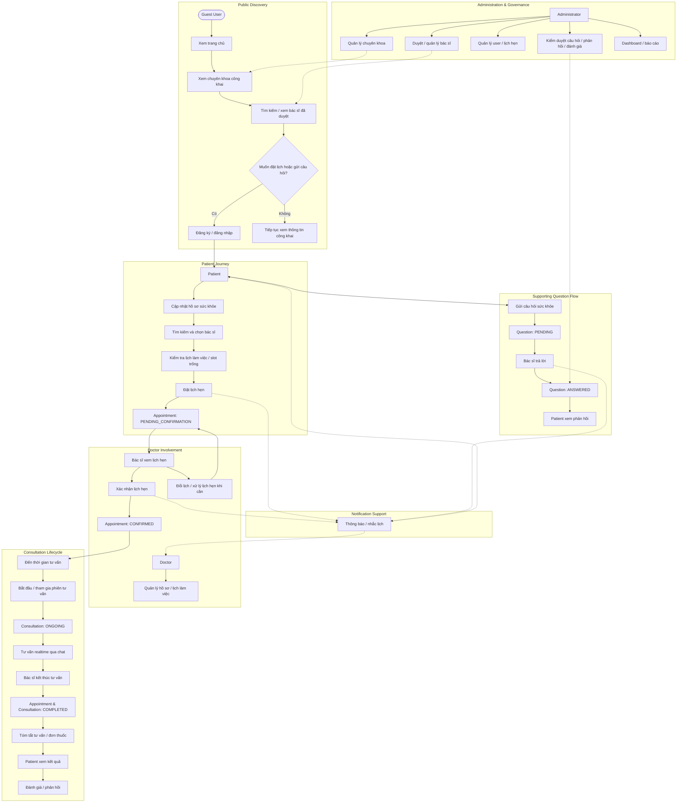

# System Flow Diagram

## Purpose

Tài liệu này mô tả luồng nghiệp vụ tổng thể của hệ thống Online Health Consultation từ góc nhìn người dùng. Diagram này không phải Architecture Diagram, Sequence Diagram, Use Case Diagram hay sơ đồ điều hướng frontend chi tiết.

Mục tiêu chính là trả lời câu hỏi:

> Người dùng đi qua các bước chính nào trong vòng đời tư vấn sức khỏe trực tuyến?

Nguồn kiểm chứng:

- SRS cuối cùng: `docs/srs/OnlineHealthConsultationPlatform_SRS_v1.0.md`.
- Traceability matrix cuối cùng: `docs/audit/final-srs-traceability.md`.
- Kiến trúc cuối cùng: `docs/architecture/system-architecture.md`.
- Graphify outputs: `graphify-out/GRAPH_REPORT.md`, `graphify-out/graph.json`, `graphify-out/manifest.json`.
- Source code cuối cùng cho các transition quan trọng trong appointment, consultation, question, notification và reporting.

## Overall System Flow

## Flow Explanation

### Public flow

Guest User bắt đầu ở khu vực công khai, xem trang chủ, danh sách chuyên khoa và danh sách bác sĩ đã được duyệt. Khi muốn đặt lịch hoặc gửi câu hỏi, người dùng được chuyển sang đăng ký hoặc đăng nhập. Flow này tương ứng với nhóm `UC-G-*` trong SRS và đã được traceability xác nhận là completed cho public discovery.

### Patient appointment flow

Sau khi đăng nhập với vai trò Patient, người dùng cập nhật hồ sơ sức khỏe, tìm kiếm/chọn bác sĩ, kiểm tra slot trống rồi đặt lịch hẹn. Source code xác nhận appointment mới được tạo với trạng thái `PENDING_CONFIRMATION`. Doctor sau đó xem và xác nhận lịch hẹn, đưa appointment sang `CONFIRMED`.

### Consultation flow

Khi đến thời gian tư vấn, Patient và Doctor tham gia consultation. Consultation được start/join và chuyển sang trạng thái `ONGOING`; chat realtime được lưu và broadcast qua Socket.IO. Khi bác sĩ kết thúc phiên tư vấn, consultation và appointment chuyển sang `COMPLETED`. Sau đó bác sĩ có thể ghi tóm tắt và tạo đơn thuốc, Patient xem kết quả và gửi rating.

### Doctor involvement

Doctor không chỉ tham gia ở thời điểm consultation. Trước đó doctor quản lý hồ sơ, lịch làm việc, xem lịch hẹn, xác nhận hoặc đổi lịch khi cần. Doctor cũng xử lý supporting question flow bằng cách xem câu hỏi và trả lời cho Patient.

### Notification support

Notification là supporting process, không phải luồng chính. Các điểm gắn notification quan trọng gồm: appointment created, appointment confirmed, appointment reminder và question answered. Implementation hiện tại dùng outbox/log/provider boundary; email thật phụ thuộc cấu hình provider, còn SMS là optional/provider-dependent.

### Admin involvement

Admin là luồng quản trị bên cạnh main Patient journey. Admin duyệt/quản lý doctor, quản lý chuyên khoa, user, appointment, kiểm duyệt nội dung và xem dashboard/reporting. Các thao tác này ảnh hưởng đến dữ liệu hệ thống như bác sĩ được hiển thị công khai, chuyên khoa có thể filter và nội dung được moderation.

## Scope Notes

- Diagram chỉ mô tả luồng nghiệp vụ cấp cao, không mô tả controller, service, database table hoặc class implementation.
- Appointment lifecycle chỉ hiển thị các trạng thái business quan trọng: `PENDING_CONFIRMATION`, `CONFIRMED`, `COMPLETED`.
- Consultation lifecycle chỉ hiển thị trạng thái chính trong flow hiện tại: `ONGOING`, `COMPLETED`.
- `CANCELLED` và `NO_SHOW` tồn tại trong schema/implementation nhưng không được đưa vào main happy path để tránh biến diagram thành state machine.
- Question flow chỉ hiển thị `PENDING` và `ANSWERED`; moderation/closed states được thể hiện ở nhánh Admin khi cần.
- Video consultation được SRS cho phép ở mức mô phỏng/basic integration, nhưng implementation hiện tại chủ yếu có chat realtime và video boundary/fallback. Vì vậy diagram dùng "realtime qua chat" làm main supported consultation flow.
- Notification được biểu diễn như supporting flow vì nó chạy sau các domain events và không thay đổi thứ tự nghiệp vụ chính.

## Requirements Intentionally Excluded From Current Flow

- File upload / file storage: traceability ghi `NOT_IMPLEMENTED`; Prisma có `FileAttachment` nhưng chưa có upload API/UI/storage provider trong submitted scope.
- Production SMS delivery: SRS xem SMS là optional; source có provider boundary nhưng chưa có provider production cụ thể.
- External/advanced video provider: hiện là optional boundary/mock/fallback, không phải third-party video integration hoàn chỉnh.
- Chatbot mô phỏng tư vấn sức khỏe: optional/extended, không thuộc core submitted flow.
- Advanced analytics ngoài dashboard/reporting cốt lõi: traceability ghi partial cho advanced analytics.
