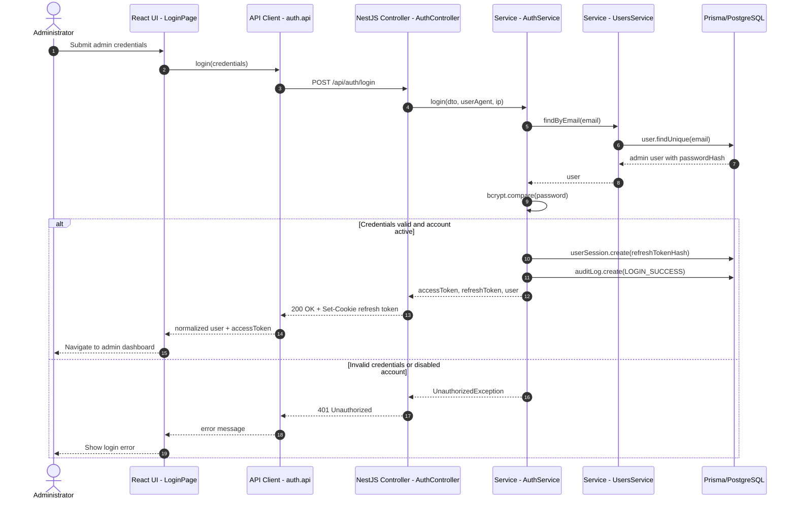
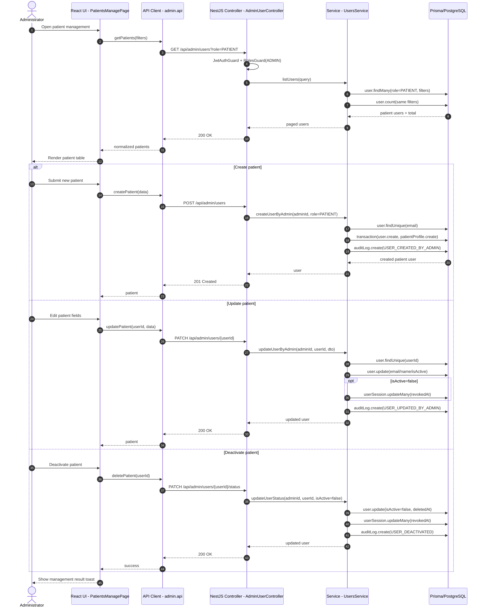
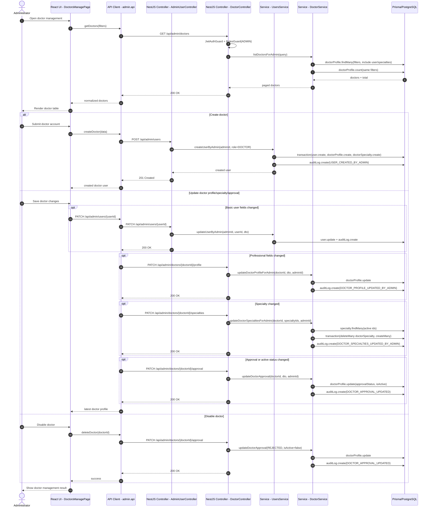
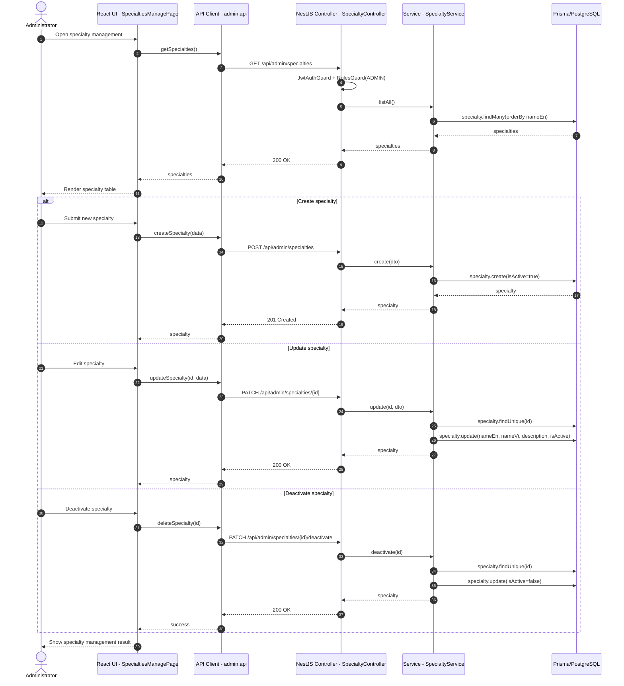
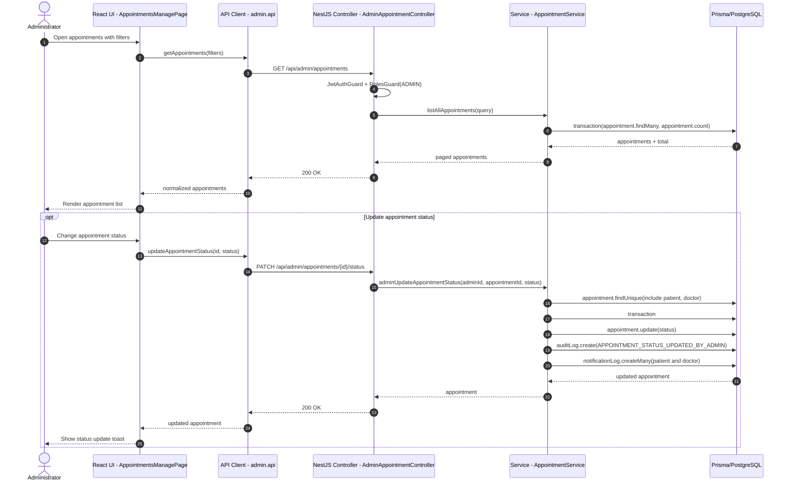
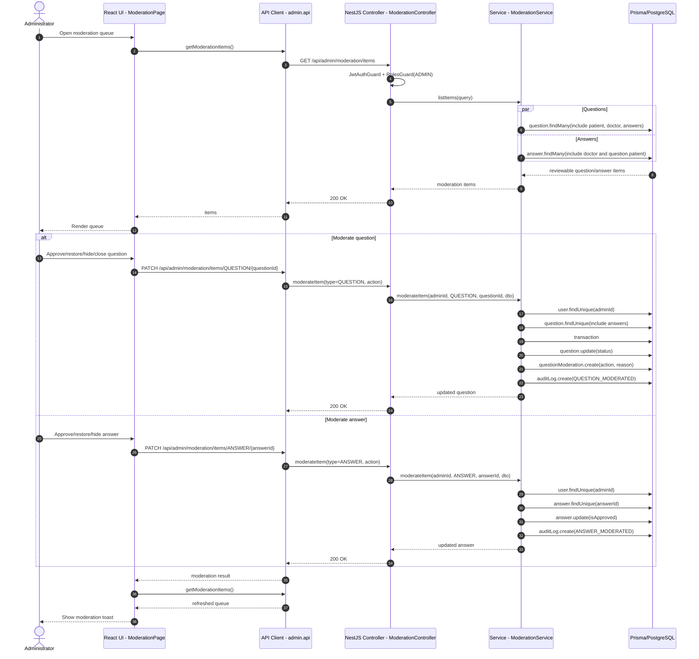
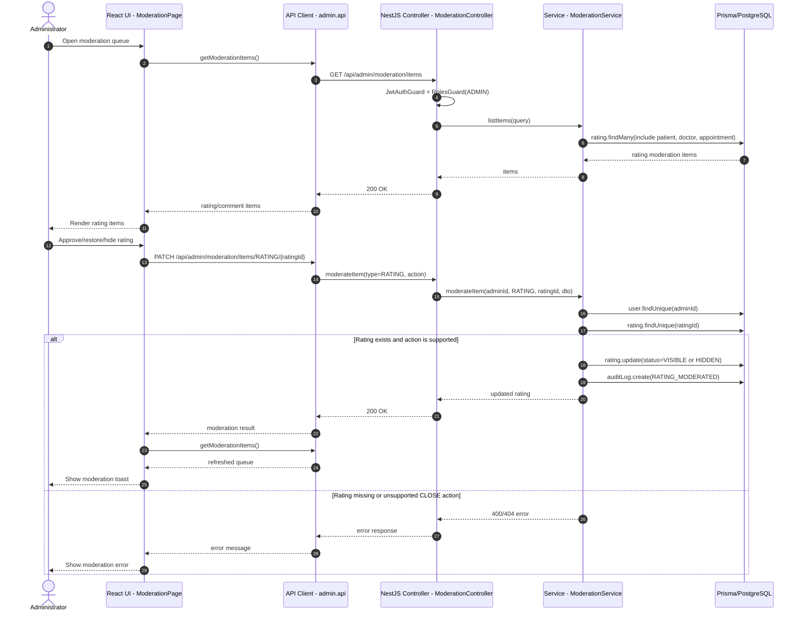
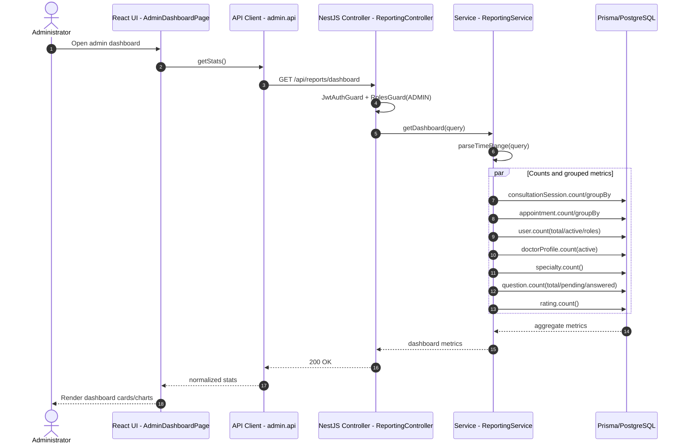
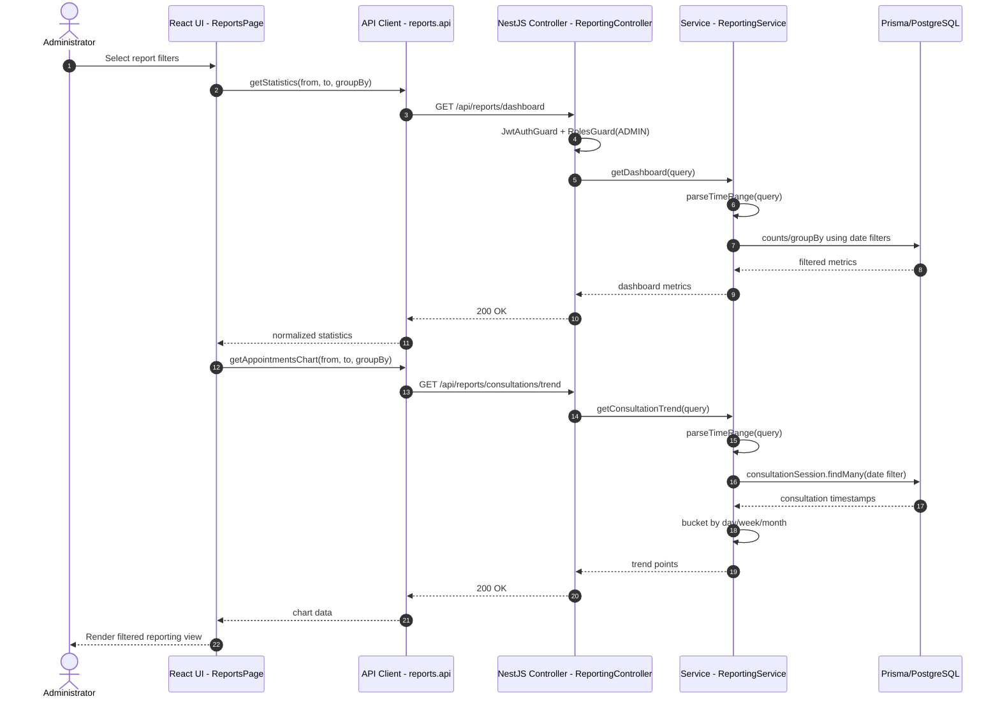

# Administrator Sequence Diagrams

Tài liệu này mô tả các sequence diagram cho luồng **Administrator** dựa trên SRS cập nhật và source implementation cuối cùng.

Nguồn đã đối chiếu:

- `docs/srs/OnlineHealthConsultationPlatform_SRS_v1.0.md`
- `OnlineHealthConsultation-Web/src/features/admin/apis/admin.api.ts`
- `OnlineHealthConsultation-Web/src/features/admin/redux/admin.saga.ts`
- `OnlineHealthConsultation-Web/src/features/reports/apis/reports.api.ts`
- `src/modules/identity/*`
- `src/modules/doctor/*`
- `src/modules/specialty/*`
- `src/modules/appointment/*`
- `src/modules/moderation/*`
- `src/modules/reporting/*`

Backend NestJS dùng global prefix `/api`. Các endpoint admin/reporting được bảo vệ bằng `JwtAuthGuard` và `RolesGuard` với `Role.ADMIN`; diagram chỉ ghi guard ở mức boundary để tránh nhiễu implementation.

## 1. Login

Administrator đăng nhập qua cùng `AuthController`/`AuthService` với các role khác. Sau khi thành công, frontend điều hướng về dashboard admin.

## 2. Manage Patient Account

Admin patient management is implemented through `AdminUserController` using role-filtered `/api/admin/users` endpoints. Delete/deactivate is a status update in the frontend patient flow.

## 3. Manage Doctor Account

Doctor management combines user account endpoints and doctor profile endpoints. Frontend may call multiple backend endpoints in one "update doctor" action.

## 4. Manage Specialty

Specialty CRUD is implemented by `SpecialtyController` under `/api/admin/specialties`; delete in frontend is a deactivate operation.

## 5. Manage Appointment

Admin lists appointments through `/api/admin/appointments` and updates status through `/api/admin/appointments/{id}/status`.

## 6. Moderate Health Question/Response

Questions and answers are loaded through the unified moderation list. Question moderation updates question status and creates `QuestionModeration`; answer moderation toggles `Answer.isApproved`.

## 7. Moderate Rating/Comment

Rating/comment moderation uses the same moderation endpoint with type `RATING`. Implementation maps `HIDE` to `RatingStatus.HIDDEN`; approve/restore maps to `VISIBLE`.

## 8. View Dashboard

Admin dashboard stats call `/api/reports/dashboard`. `ReportingService` runs aggregate/count queries in parallel.

## 9. Filter/View Consultation Reporting

Reports page calls dashboard metrics and consultation trend endpoints with `from`, `to` and `groupBy` filters.

## Notes

- Admin account management uses `AdminUserController`; patient-specific management is currently user-account based rather than a separate admin patient profile endpoint.
- Doctor management can fan out to several endpoints because frontend update combines user fields, profile fields, specialties and approval/active status.
- Specialty delete is implemented as deactivate, not physical deletion.
- Appointment status updates write `AuditLog` and create notification logs for patient and doctor.
- Moderation has one unified controller/service for questions, answers and ratings.
- Reporting is read-only and implemented in the modular monolith through `ReportingModule`, not an external analytics service.
