# Doctor Sequence Diagrams

Tài liệu này mô tả các sequence diagram cho luồng **Doctor** dựa trên SRS cập nhật và source implementation cuối cùng.

Nguồn đã đối chiếu:

- `docs/srs/OnlineHealthConsultationPlatform_SRS_v1.0.md`
- `OnlineHealthConsultation-Web/src/features/auth/apis/auth.api.ts`
- `OnlineHealthConsultation-Web/src/features/doctor/apis/doctor.api.ts`
- `OnlineHealthConsultation-Web/src/features/doctor/redux/doctor.saga.ts`
- `OnlineHealthConsultation-Web/src/features/consultation/realtime/*`
- `src/modules/identity/*`
- `src/modules/doctor/*`
- `src/modules/question/*`
- `src/modules/appointment/*`
- `src/modules/consultation/*`

Backend NestJS dùng global prefix `/api`. Các endpoint doctor/patient/consultation được bảo vệ bằng `JwtAuthGuard` và `RolesGuard`; diagram chỉ ghi guard ở mức boundary, không liệt kê decorator/DTO/helper private khi không ảnh hưởng đến luồng chính.

## 1. Login

Doctor đăng nhập qua cùng auth flow với các role khác. Backend tạo `UserSession`, trả access token và set HttpOnly refresh cookie.

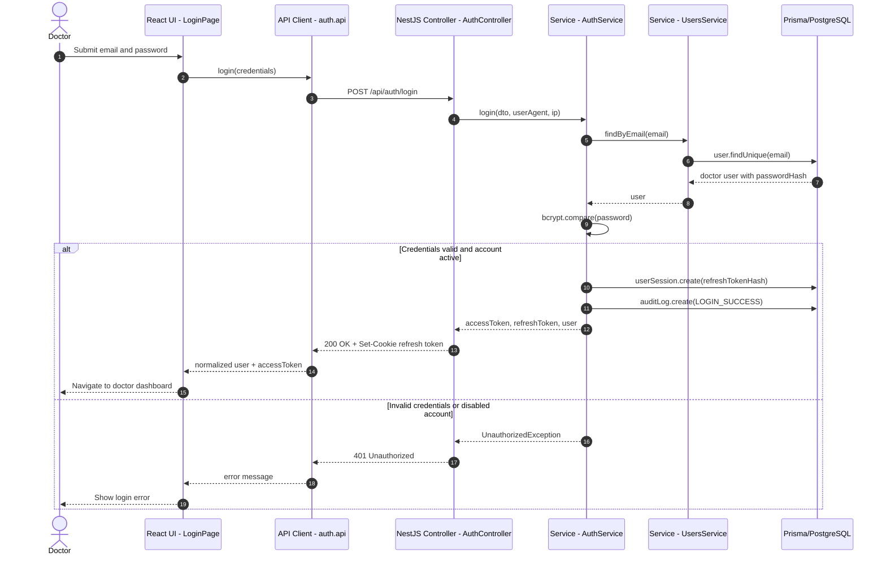

## 2. Update Professional Profile

Doctor profile update gọi `PATCH /api/doctors/me/profile`. Frontend `updateProfile()` sau đó gọi lại `GET /api/doctors/me/profile` để lấy profile mới; nếu có `specialtyId`, frontend gọi thêm endpoint specialties.

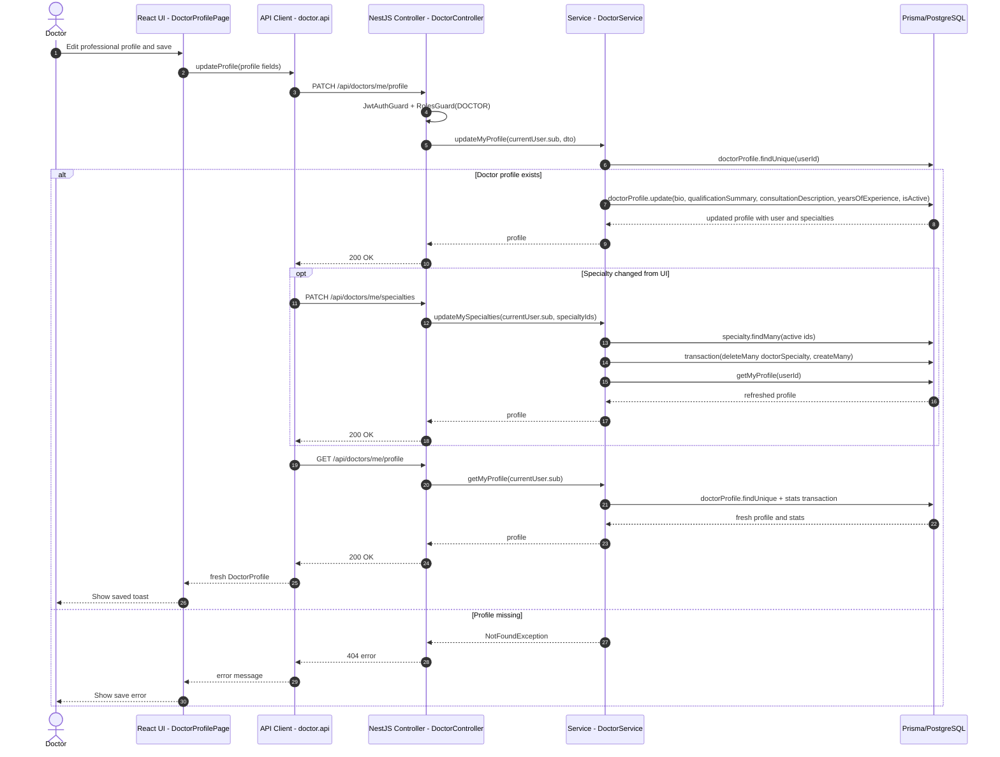

## 3. Update Working Schedule

Doctor schedule page loads schedule from profile, saves via `PATCH /api/doctors/me/schedule`, then reloads profile schedule.

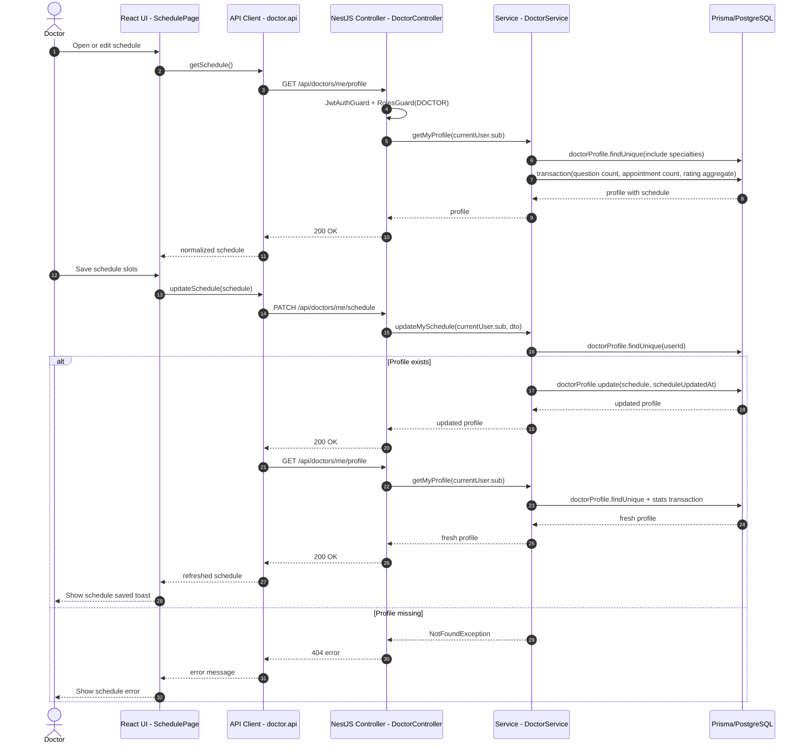

## 4. View Health Questions

Doctor xem câu hỏi qua `GET /api/questions/assigned`. Service trả câu hỏi được gán cho doctor hoặc câu hỏi mở chưa gán, loại câu hỏi đã moderated.

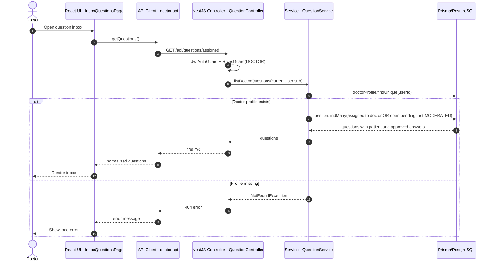

## 5. Respond To Health Question

Doctor trả lời câu hỏi qua `POST /api/questions/{id}/answers`. Service cập nhật question, tạo answer, audit log và outbox event trong transaction.

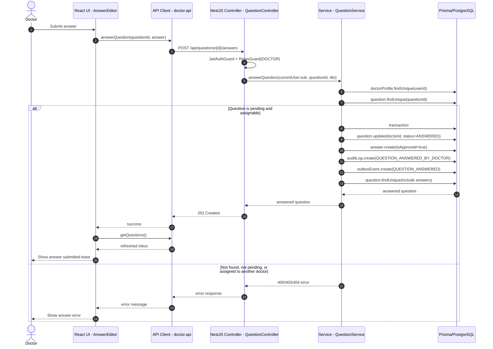

## 6. View Appointments

Doctor appointment list gọi `GET /api/appointments/doctor/me`, có thể truyền status filter.

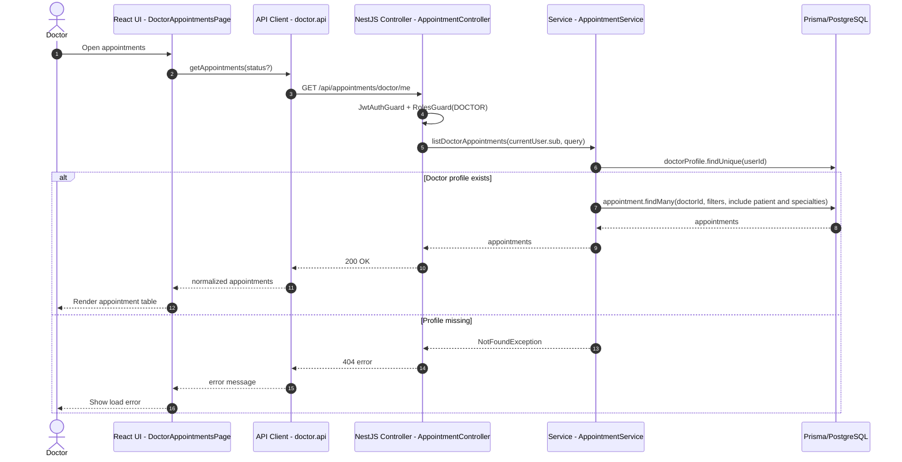

## 7. Confirm Appointment

Doctor confirm gọi `PATCH /api/appointments/{id}/confirm`. Service chỉ cho confirm appointment của chính doctor và đang `PENDING_CONFIRMATION`.

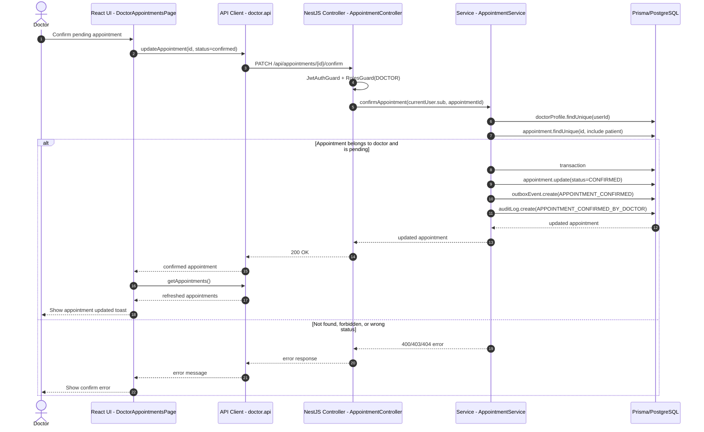

## 8. Reschedule Appointment

Doctor reschedule gọi `PATCH /api/appointments/{id}/reschedule`. Service kiểm tra quyền doctor, trạng thái, thời gian tương lai, working schedule và overlap rồi cập nhật appointment.

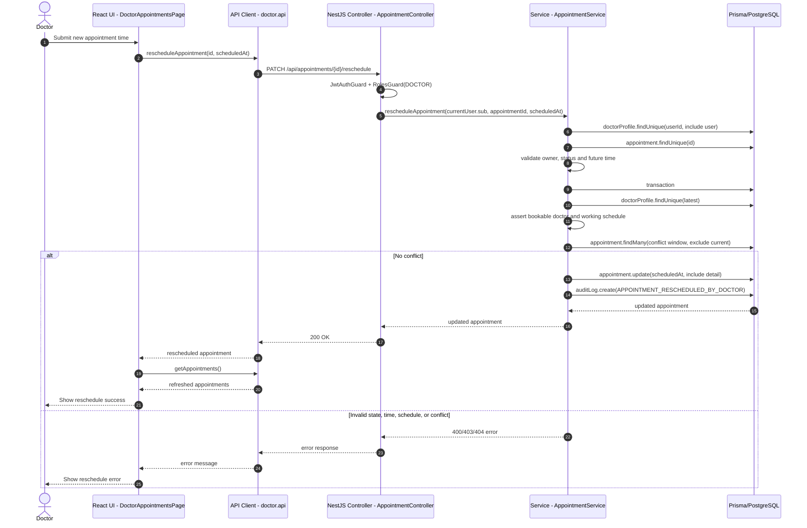

## 9. Start Consultation

Doctor starts consultation with `POST /api/consultations/{appointmentId}/start`. Service may confirm a pending appointment, then creates or updates `ConsultationSession`.

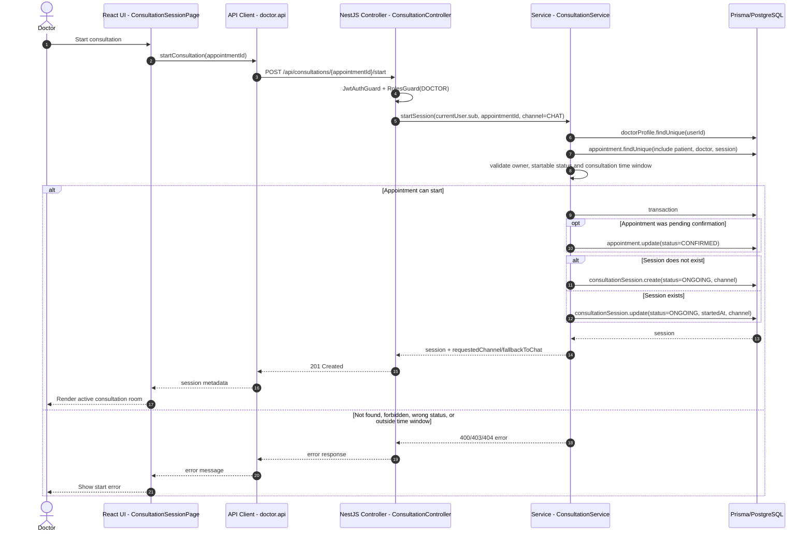

## 10. Realtime Consultation Chat

Doctor realtime chat dùng Socket.IO namespace `/consultations`. Gateway xác thực JWT trong handshake, gọi `ConsultationService` để join room và persist message. REST send message vẫn tồn tại như fallback.

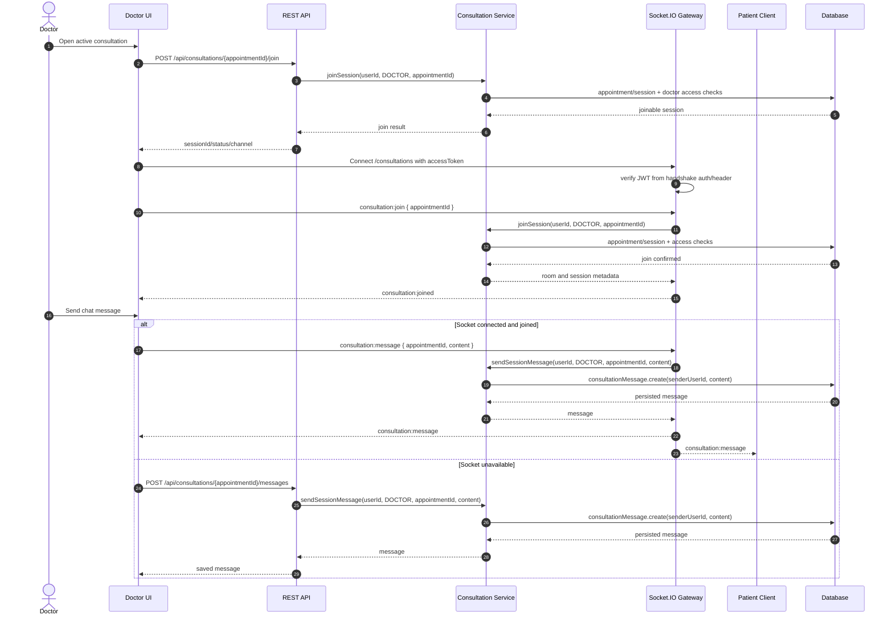

## 11. Save Consultation Summary

Doctor saves the clinical summary through `PATCH /api/consultations/{appointmentId}/summary`. Service requires a session and doctor ownership.

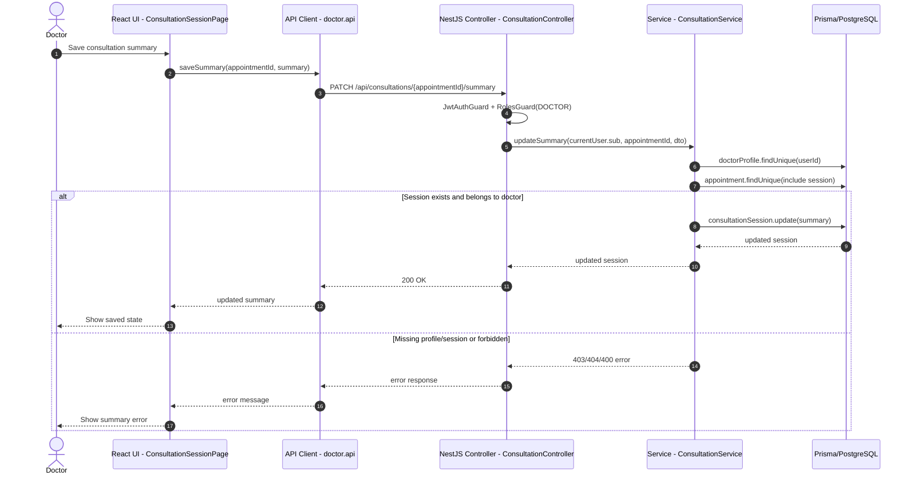

## 12. End Consultation

Doctor ends a session through `PATCH /api/consultations/{appointmentId}/end`. Service marks both session and appointment completed in one transaction.

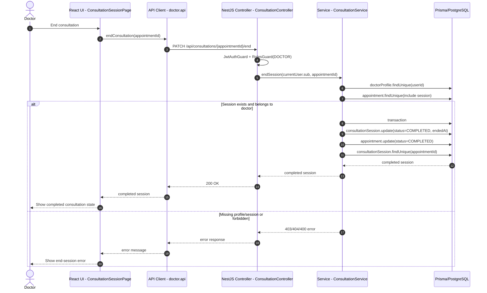

## 13. Create Prescription

Doctor creates or replaces prescription through `POST /api/consultations/{appointmentId}/prescriptions`. Implementation requires appointment status `COMPLETED`.

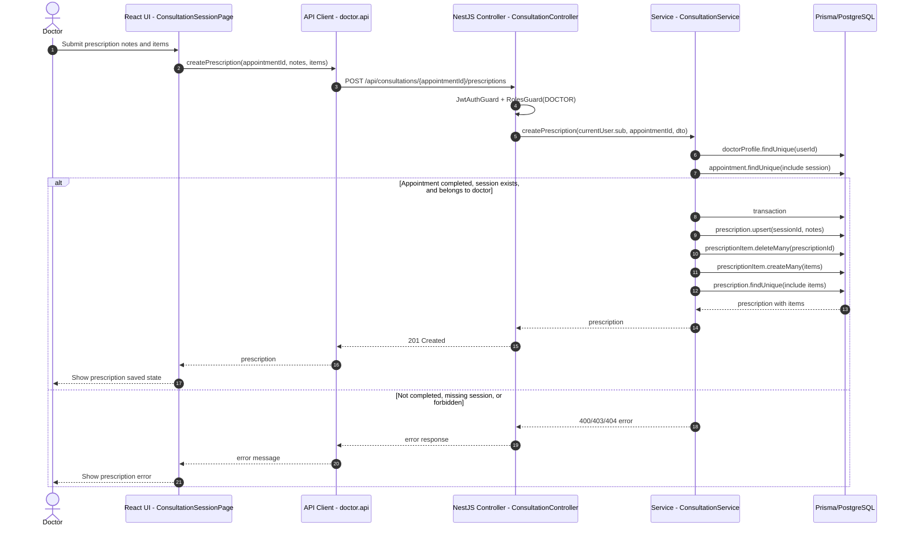

## 14. View Consultation History

Backend có endpoint doctor history `GET /api/consultations/doctor/me`. Service trả các `ConsultationSession` của doctor kèm appointment/patient và prescription items.

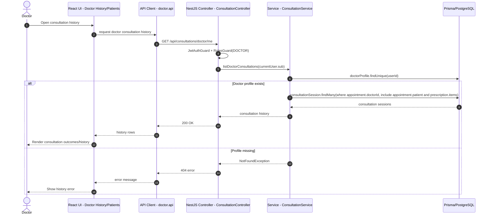

## Notes

- Doctor endpoints are guarded by JWT authentication and `Role.DOCTOR` authorization in controllers.
- Updating doctor specialties is a separate endpoint from profile field updates; frontend may call it from the same profile save action when specialty changes.
- Appointment confirmation creates `OutboxEvent` and `AuditLog`; reschedule creates `AuditLog` only in the current implementation.
- Starting consultation creates or updates `ConsultationSession`; ending consultation marks both session and appointment completed.
- Realtime chat persists every message through `ConsultationService.sendSessionMessage()` before broadcasting it through Socket.IO.
