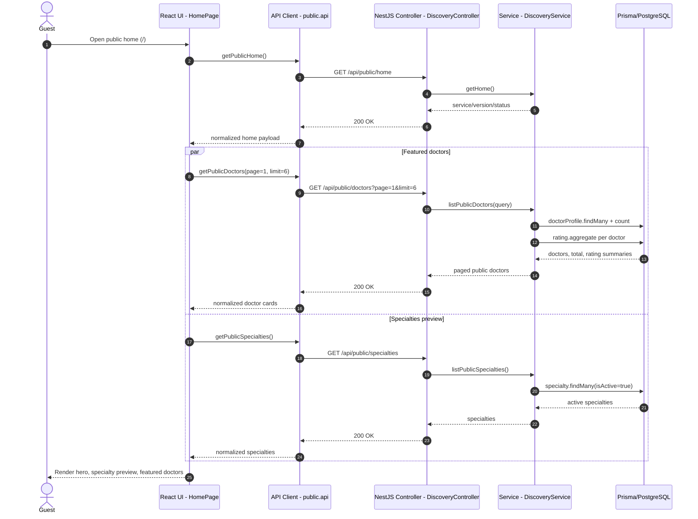
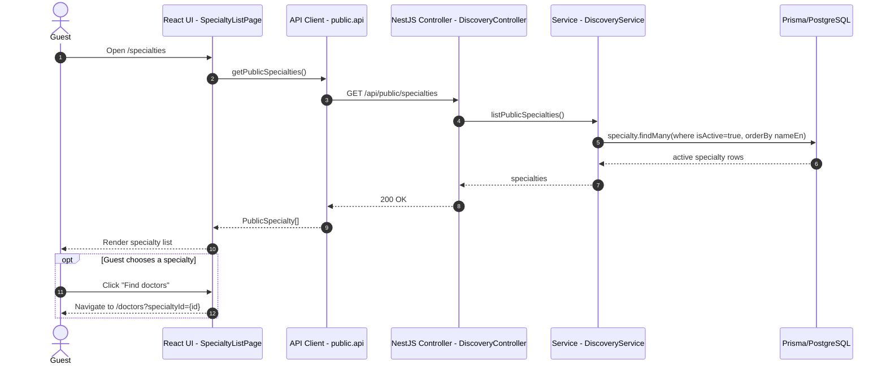
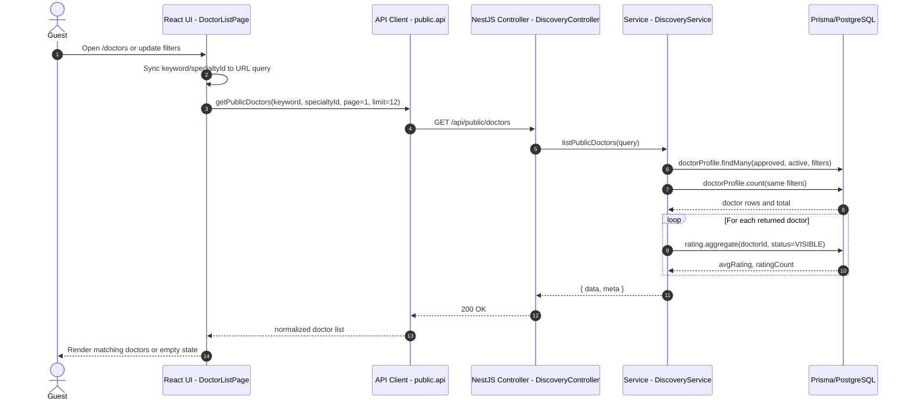
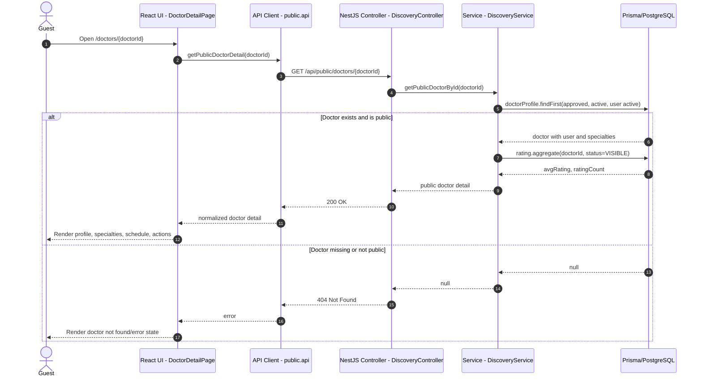
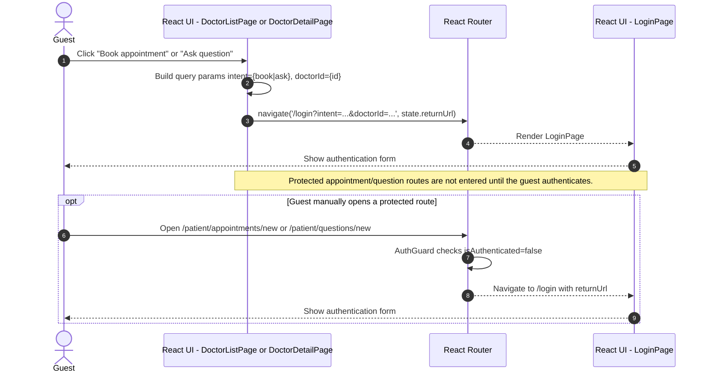

# Guest Sequence Diagrams

Tài liệu này mô tả các sequence diagram cho luồng **Guest User** dựa trên SRS cập nhật và source implementation hiện tại.

Nguồn đã đối chiếu:

- `docs/srs/OnlineHealthConsultationPlatform_SRS_v1.0.md`
- `OnlineHealthConsultation-Web/src/pages/HomePage.tsx`
- `OnlineHealthConsultation-Web/src/features/public/apis/public.api.ts`
- `OnlineHealthConsultation-Web/src/features/public/pages/SpecialtyListPage.tsx`
- `OnlineHealthConsultation-Web/src/features/public/pages/DoctorListPage.tsx`
- `OnlineHealthConsultation-Web/src/features/public/pages/DoctorDetailPage.tsx`
- `OnlineHealthConsultation-Web/src/features/public/pages/publicPageUtils.ts`
- `src/modules/discovery/discovery.controller.ts`
- `src/modules/discovery/discovery.service.ts`
- `src/main.ts`

Backend NestJS dùng global prefix `/api`, vì vậy các public endpoint thực tế là `/api/public/...`. Diagram chỉ thể hiện các participant cần thiết cho từng flow, không đưa vào guard/helper/class nội bộ không liên quan.

## 1. View Public Home

Flow này tương ứng `UC-G-01` và implementation trong `HomePage`. Khi guest vào trang chủ, React UI tải song song public home metadata, danh sách bác sĩ nổi bật và danh sách chuyên khoa.

## 2. Browse Specialties

Flow này tương ứng `UC-G-02`. Trang danh sách chuyên khoa gọi public API để lấy các specialty đang active và hiển thị cho guest.

## 3. Search Doctor

Flow này tương ứng `UC-G-03` và `UC-G-05`. Trang doctors đọc `keyword` và `specialtyId` từ UI/query string, debounce khoảng 250ms rồi gọi public doctor discovery endpoint.

## 4. View Doctor Detail

Flow này tương ứng `UC-G-04`. Guest mở trang chi tiết bác sĩ, frontend gọi public detail endpoint. Backend chỉ trả bác sĩ đang active, được duyệt và có user active/chưa bị xóa mềm.

## 5. Attempt Protected Action -> Authentication Redirect

Flow này tương ứng `UC-G-06`. Trong implementation hiện tại, guest không gọi thẳng protected backend endpoint khi bấm đặt lịch hoặc gửi câu hỏi từ trang public. React dùng `redirectGuestToLogin()` để chuyển sang `/login` kèm `intent`, `doctorId` và `state.returnUrl`.

## Notes

- Public discovery flows đi qua `DiscoveryController` và `DiscoveryService`.
- `/api/public/home` không truy cập database; trang chủ vẫn tải thêm doctors và specialties để render nội dung public.
- Search doctor và doctor detail có truy vấn rating summary từ bảng `Rating` thông qua Prisma aggregate.
- Protected action redirect hiện là hành vi frontend chủ động; backend protected endpoints vẫn được bảo vệ bằng `JwtAuthGuard`/`RolesGuard`, nhưng không phải luồng chính khi guest bấm CTA public.
