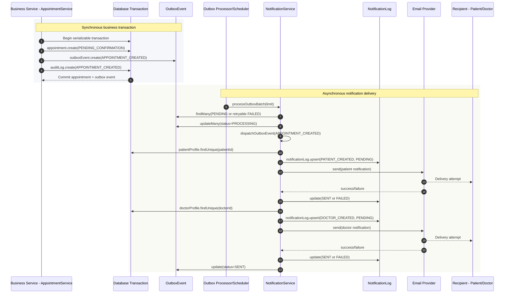
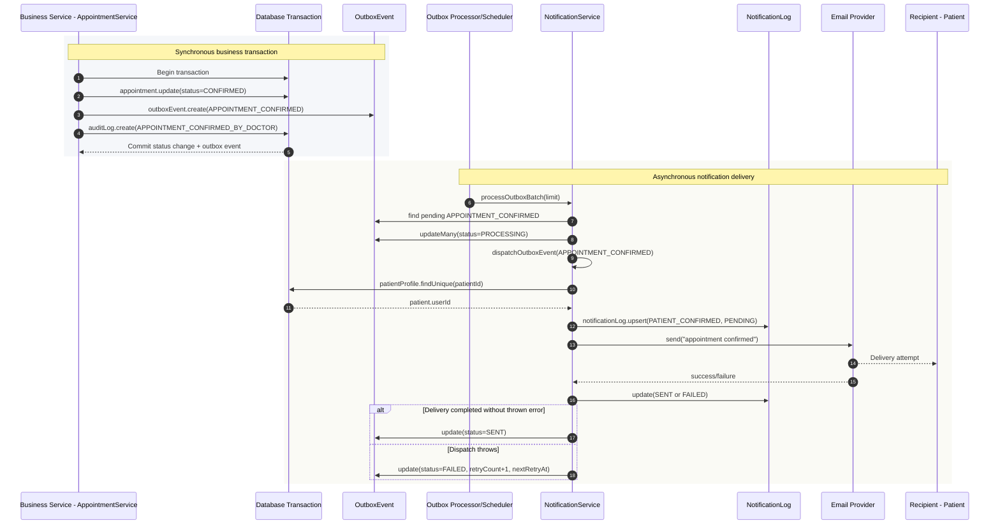
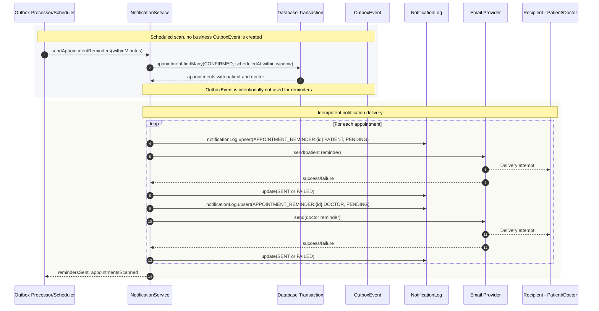
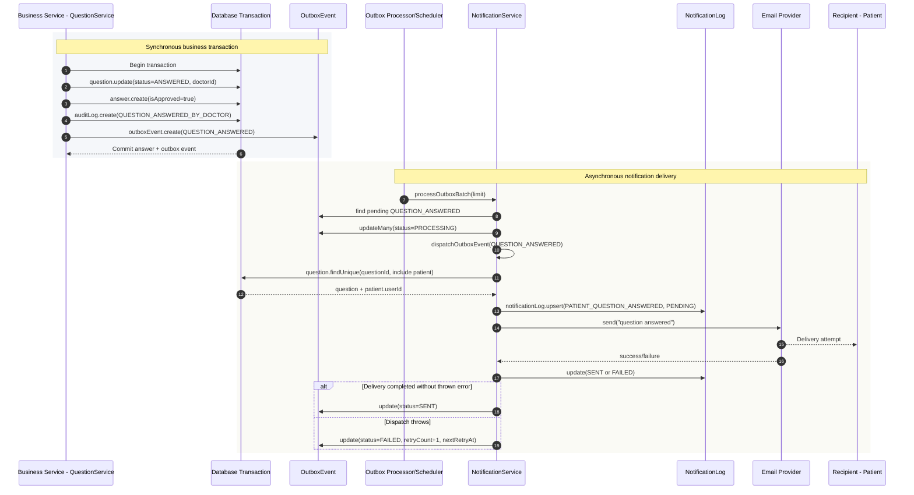
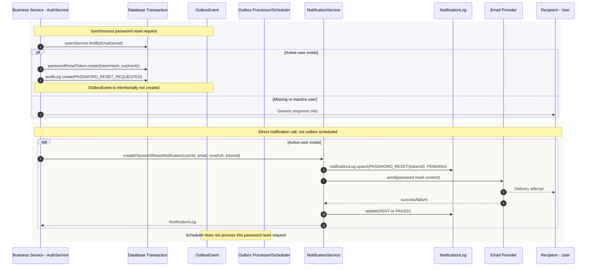

# Notification Sequence Diagrams

Tài liệu này mô tả các luồng notification dựa trên implementation cuối cùng của backend NestJS.

Nguồn đã đối chiếu:

- `src/modules/appointment/appointment.service.ts`
- `src/modules/question/question.service.ts`
- `src/modules/identity/auth.service.ts`
- `src/modules/notification/notification.service.ts`
- `src/modules/notification/notification.scheduler.ts`
- `src/modules/notification/providers/*.ts`
- `prisma/schema.prisma`

Các diagram phân biệt rõ:

- **Synchronous business transaction**: service nghiệp vụ ghi domain data, `AuditLog` và/hoặc `OutboxEvent` trong DB transaction.
- **Asynchronous notification delivery**: `NotificationScheduler` chạy cron, gọi `NotificationService.processOutboxBatch()`, claim `OutboxEvent`, tạo `NotificationLog`, gọi provider, rồi cập nhật trạng thái delivery.

Lưu ý implementation hiện tại:

- Appointment created, appointment confirmed và health question answered dùng `OutboxEvent`.
- Appointment reminder không dùng `OutboxEvent`; scheduler quét appointment sắp tới và gửi notification idempotent trực tiếp.
- Password reset email không dùng `OutboxEvent`; `AuthService` tạo reset token rồi gọi `NotificationService.createPasswordResetNotification()` trực tiếp. Provider thực tế có thể là `DEV_NOTIFICATION` hoặc `EMAIL_PROVIDER` tùy env.

## 1. Appointment Created Notification

`AppointmentService.createAppointment()` tạo appointment, outbox event và audit log trong cùng transaction. Delivery diễn ra sau đó bởi scheduler.

## 2. Appointment Confirmed Notification

`AppointmentService.confirmAppointment()` cập nhật appointment sang `CONFIRMED`, tạo outbox event `APPOINTMENT_CONFIRMED` và audit log. Processor hiện gửi notification cho patient.

## 3. Appointment Reminder

Reminder không đi qua `OutboxEvent`. `NotificationScheduler` chạy cron riêng, quét appointment `CONFIRMED` trong cửa sổ thời gian cấu hình và gọi `createNotificationIdempotent()` cho patient và doctor.

## 4. Health Question Answered Notification

`QuestionService.answerQuestion()` cập nhật question, tạo answer, audit log và outbox event `QUESTION_ANSWERED`. Processor sau đó tìm patient của question và gửi notification.

## 5. Password Reset Email

Password reset notification không dùng outbox. `AuthService.forgotPassword()` tạo `PasswordResetToken` và audit log trước, sau đó gọi `NotificationService.createPasswordResetNotification()` trực tiếp. Method này vẫn ghi `NotificationLog` idempotent và gọi provider.

## Notes

- `NotificationService.createNotificationIdempotent()` uses `NotificationLog.externalRef` for idempotency.
- Default notification type is `EMAIL`; SMS exists in provider selection but these implemented flows use email-type notifications.
- In development, the resolved provider is usually `DEV_NOTIFICATION`; in production-like configuration it may resolve to `EMAIL_PROVIDER`.
- `EmailNotificationProvider` is a dry-run provider unless `NOTIFICATION_EMAIL_PROVIDER_ENABLED=true`.
- Outbox retry behavior marks failed events as `FAILED`, increments `retryCount`, and sets `nextRetryAt` five minutes later.
