# Patient Sequence Diagrams

Tài liệu này mô tả các sequence diagram cho luồng **Patient** dựa trên SRS cập nhật và source implementation cuối cùng.

Nguồn đã đối chiếu:

- `docs/srs/OnlineHealthConsultationPlatform_SRS_v1.0.md`
- `OnlineHealthConsultation-Web/src/features/auth/apis/auth.api.ts`
- `OnlineHealthConsultation-Web/src/features/auth/redux/auth.saga.ts`
- `OnlineHealthConsultation-Web/src/features/patient/apis/patient.api.ts`
- `OnlineHealthConsultation-Web/src/features/patient/redux/patient.saga.ts`
- `OnlineHealthConsultation-Web/src/features/patient/pages/PatientConsultationSessionPage.tsx`
- `OnlineHealthConsultation-Web/src/features/consultation/realtime/*`
- `src/modules/identity/*`
- `src/modules/patient/*`
- `src/modules/discovery/*`
- `src/modules/question/*`
- `src/modules/appointment/*`
- `src/modules/consultation/*`

Backend NestJS dùng global prefix `/api`. Các diagram chỉ đưa vào participant có ý nghĩa ở boundary/controller/service/persistence, không liệt kê guard, decorator, DTO hoặc helper private khi chúng không phải điểm tương tác chính.

## 1. Register

Luồng đăng ký patient gọi `POST /api/auth/register`. Controller dùng `UsersService.createUser()`, service tạo `User` và profile tương ứng theo role.

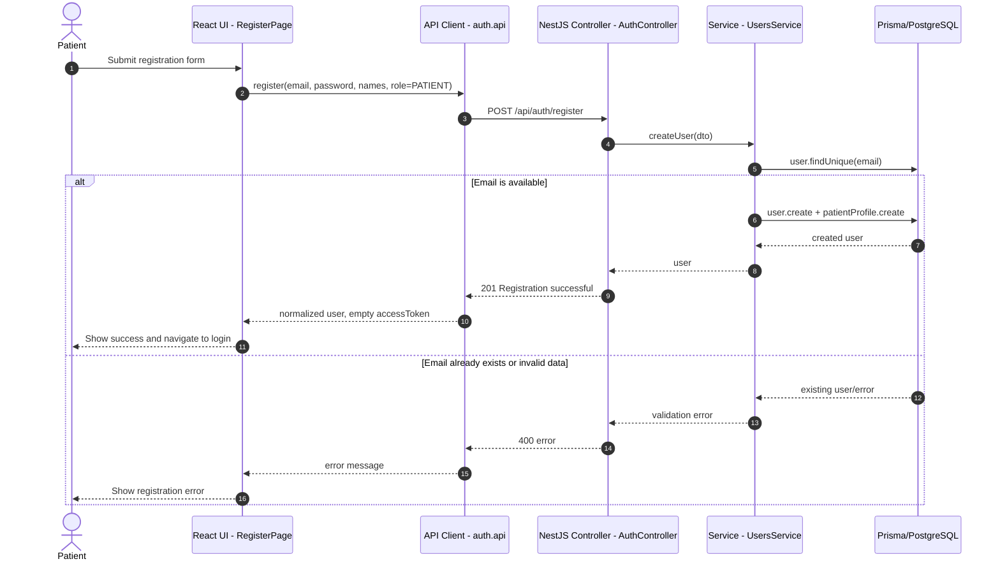

## 2. Login

Luồng đăng nhập gọi `POST /api/auth/login`. Backend xác thực mật khẩu, tạo `UserSession`, trả access token và set HttpOnly refresh cookie.

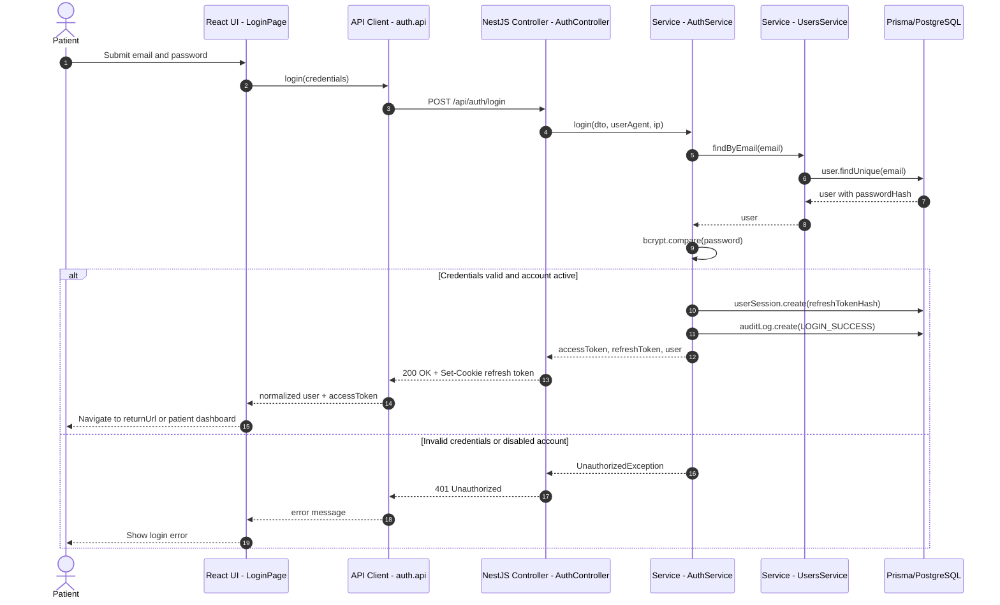

## 3. Update Health Profile

Patient profile update gọi `PATCH /api/patients/me/profile`. Service tạo `PatientProfile` nếu chưa có, sau đó update thông tin sức khỏe.

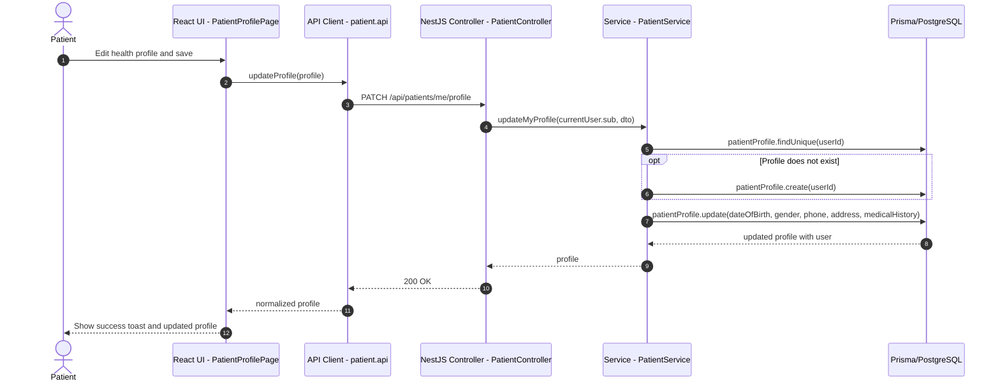

## 4. Search Doctor

Patient search reuses public discovery APIs through `patient.api`, so the backend path is the same as guest discovery.

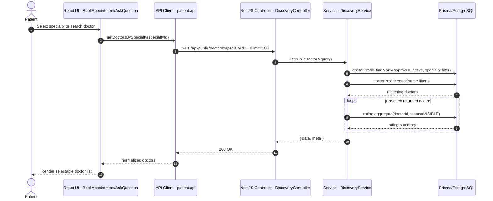

## 5. Submit Health Question

Patient gửi câu hỏi qua `POST /api/questions`. Service yêu cầu patient profile tồn tại và kiểm tra doctor nếu có `doctorId`.

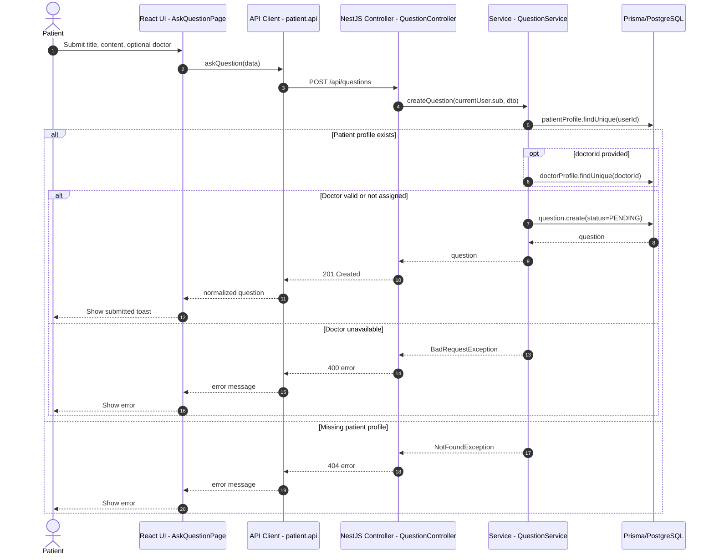

## 6. Book Appointment

Patient đặt lịch qua `POST /api/appointments`. Service kiểm tra patient, doctor, thời gian tương lai, lịch làm việc, conflict của doctor/patient rồi tạo appointment, outbox event và audit log trong transaction serializable.

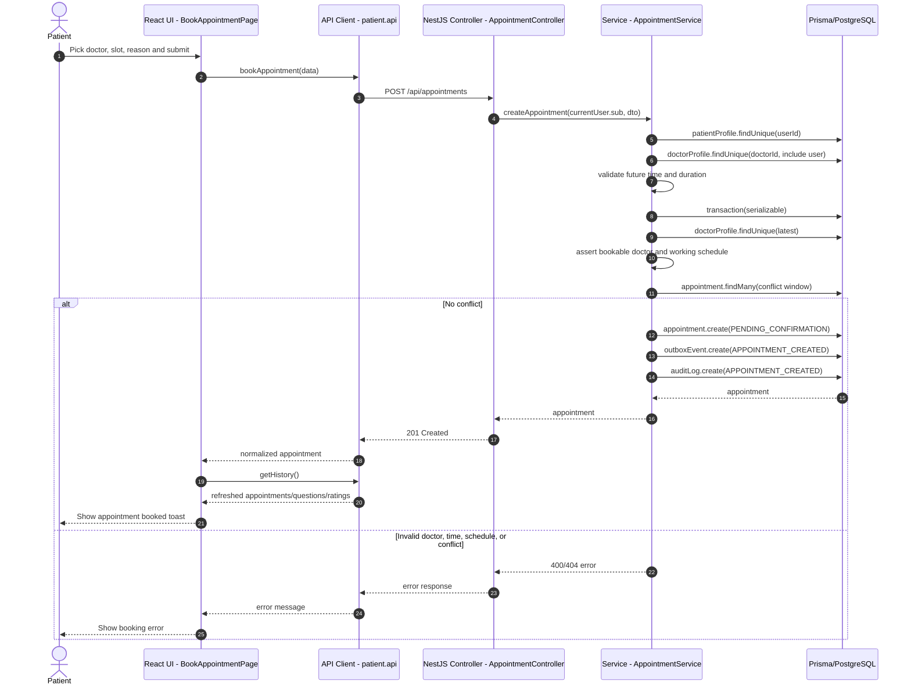

## 7. View Appointments

Patient appointment/history screens call `getHistory()`, which loads questions, appointments and ratings in parallel. Appointments come from `GET /api/appointments/mine`.

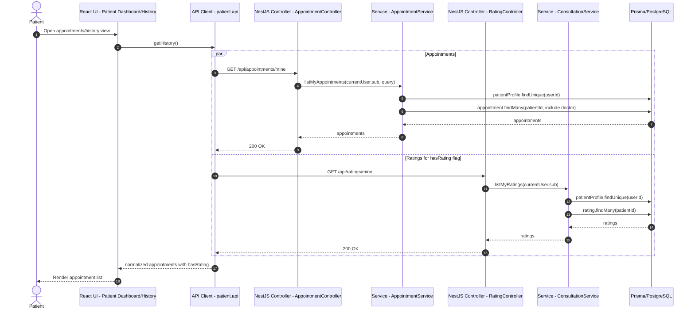

## 8. Cancel Appointment

Patient hủy lịch qua `PATCH /api/appointments/{id}/cancel`. Service chỉ cho hủy appointment thuộc patient hiện tại và chưa `CANCELLED`/`COMPLETED`.

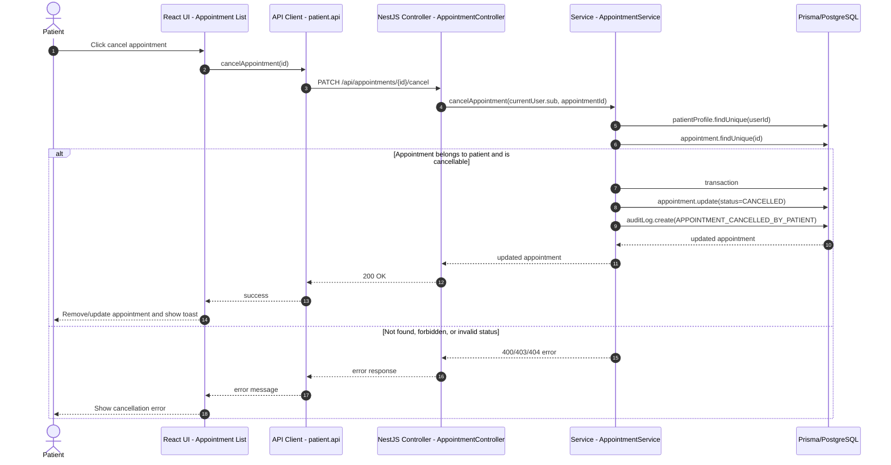

## 9. Join Consultation

Patient page first fetches consultation result, then calls `POST /api/consultations/{appointmentId}/join`, then loads persisted messages.

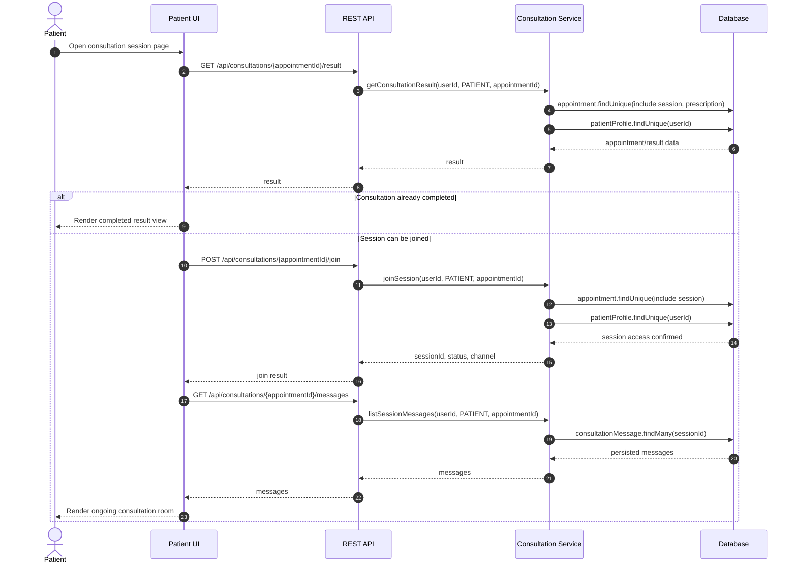

## 10. Realtime Chat

Realtime consultation dùng REST để join/load fallback, và Socket.IO namespace `/consultations` để join room và broadcast message. Nếu socket chưa sẵn sàng, UI fallback sang REST `POST /messages`.

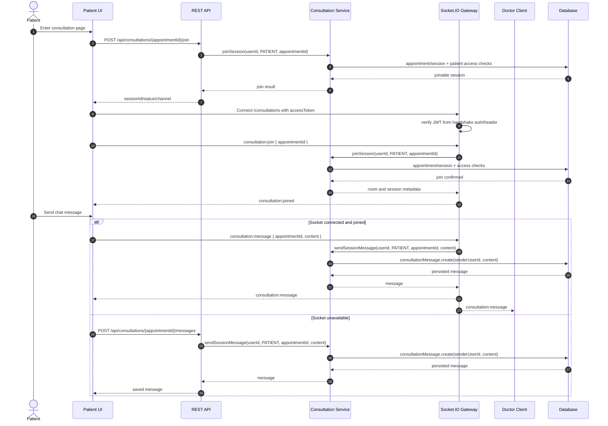

## 11. View Consultation Result

Patient xem kết quả tư vấn qua `GET /api/consultations/{appointmentId}/result`. Response gồm appointment, consultation summary/channel và prescription nếu có.

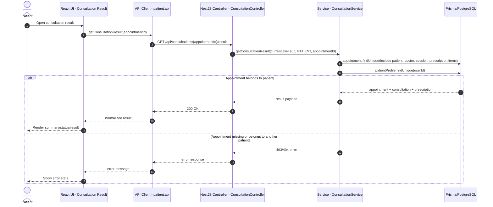

## 12. View Prescription

Không có endpoint prescription riêng cho patient. Prescription được trả kèm trong `GET /api/consultations/{appointmentId}/result`.

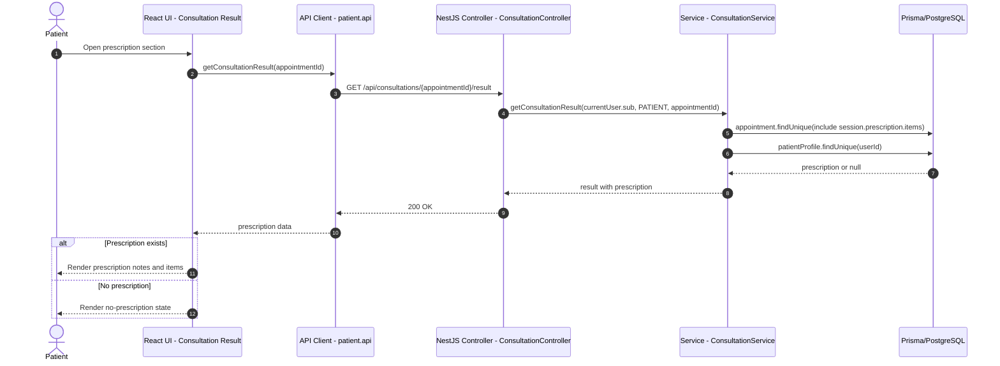

## 13. Consultation History

Frontend `getHistory()` hiện tải questions, appointments và ratings song song. Backend cũng có `GET /api/consultations/mine`, nhưng patient UI đang dùng history aggregate từ patient API để dựng màn hình lịch sử.

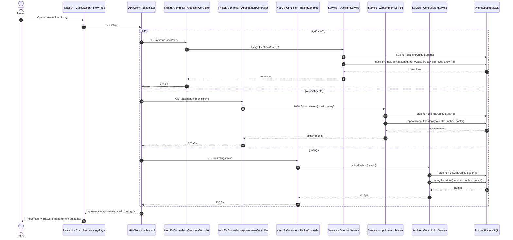

## 14. Submit Rating

Patient gửi đánh giá qua `POST /api/ratings`. Service chỉ nhận appointment đã `COMPLETED`, thuộc patient hiện tại và chưa có rating.

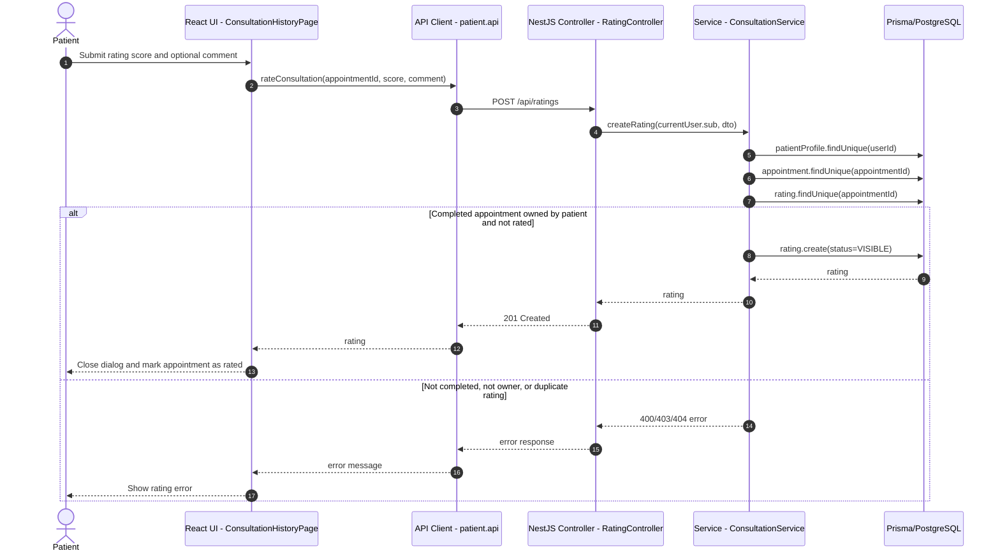

## 15. Forgot/Reset Password

Forgot password always returns a generic message. If the user exists and is active, backend stores a hashed reset token, writes audit log and asks `NotificationService` to create password reset notification. Reset password validates token hash, updates password, marks token used and revokes active sessions in a transaction.

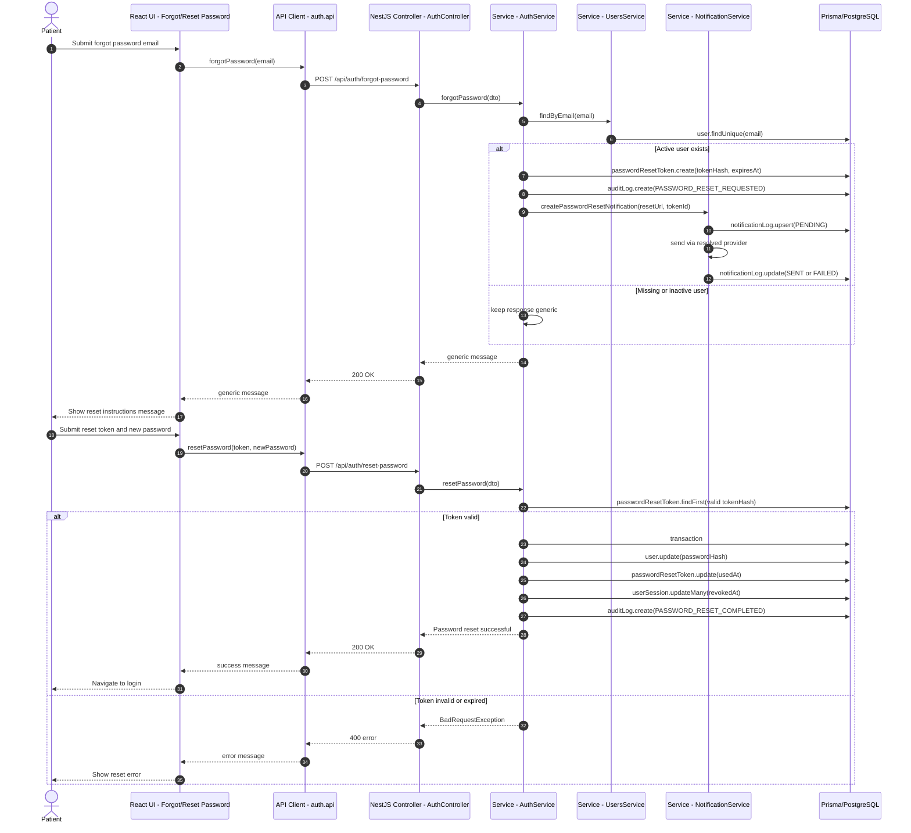

## Notes

- Protected patient endpoints require JWT authentication and patient role through NestJS guards, but the diagrams omit guard internals unless they materially change the flow.
- Patient search doctor uses public discovery endpoints, not a separate patient-only search endpoint.
- `getHistory()` in frontend is an aggregate client function, not a backend endpoint.
- Patient prescription view uses consultation result response; there is no separate patient prescription endpoint in the final implementation.
- Realtime chat emits persisted messages through `ConsultationGateway`; REST message send remains a fallback when socket is not connected/joined.
