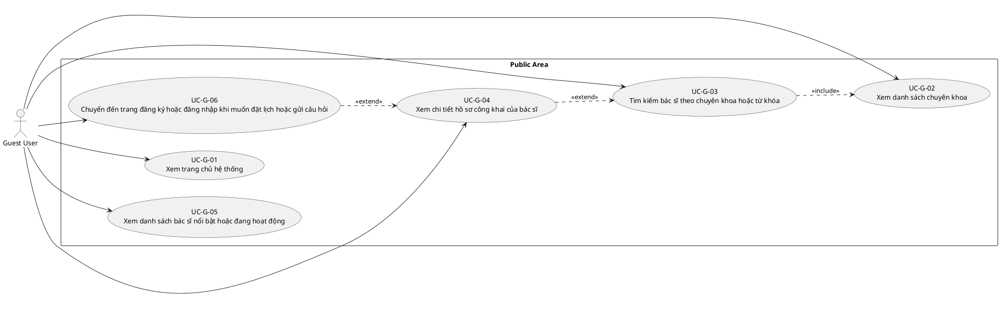
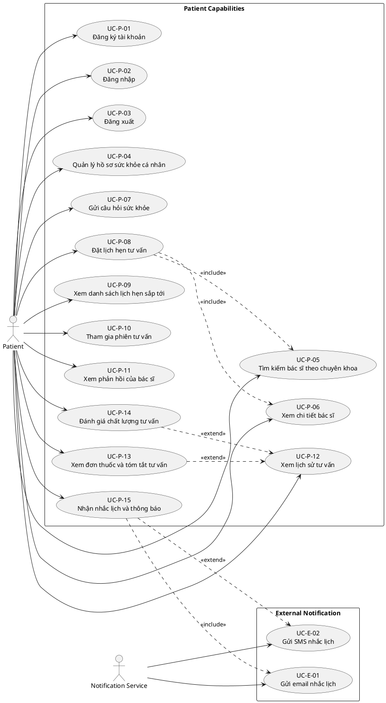
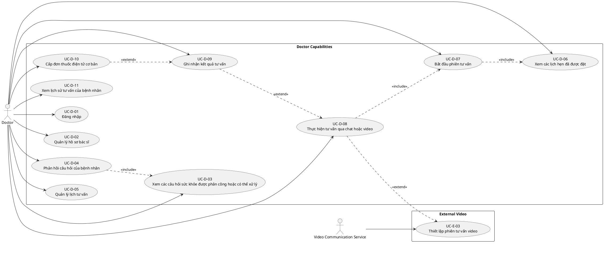
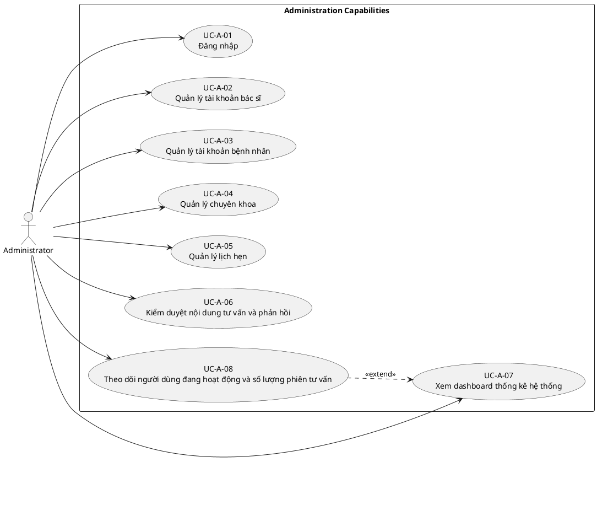

# Use Case Diagrams

Tài liệu này tạo các use case diagram dựa trên SRS cập nhật tại `docs/srs/OnlineHealthConsultationPlatform_SRS_v1.0.md`. SRS là nguồn sự thật cho danh sách use case và ID chính thức.

Diagram dùng PlantUML vì PlantUML hỗ trợ use case notation native. Mermaid hiện không có use case diagram syntax chuẩn tương đương, nên PlantUML giúp giữ actor, system boundary, include/extend và use case ID rõ ràng hơn.

## 1. Overall System

```plantuml
@startuml
left to right direction
skinparam packageStyle rectangle

actor "Guest User" as Guest
actor "Patient" as Patient
actor "Doctor" as Doctor
actor "Administrator" as Admin
actor "Notification Service" as NotifySvc
actor "Video Communication Service" as VideoSvc
actor "File Storage Service" as FileSvc

rectangle "Online Health Consultation System" {
  package "Guest User" {
    usecase "UC-G-01\nXem trang chủ hệ thống" as UCG01
    usecase "UC-G-02\nXem danh sách chuyên khoa" as UCG02
    usecase "UC-G-03\nTìm kiếm bác sĩ theo chuyên khoa hoặc từ khóa" as UCG03
    usecase "UC-G-04\nXem chi tiết hồ sơ công khai của bác sĩ" as UCG04
    usecase "UC-G-05\nXem danh sách bác sĩ nổi bật hoặc đang hoạt động" as UCG05
    usecase "UC-G-06\nChuyển đến đăng ký hoặc đăng nhập" as UCG06
  }

  package "Patient" {
    usecase "UC-P-01\nĐăng ký tài khoản" as UCP01
    usecase "UC-P-02\nĐăng nhập" as UCP02
    usecase "UC-P-03\nĐăng xuất" as UCP03
    usecase "UC-P-04\nQuản lý hồ sơ sức khỏe cá nhân" as UCP04
    usecase "UC-P-05\nTìm kiếm bác sĩ theo chuyên khoa" as UCP05
    usecase "UC-P-06\nXem chi tiết bác sĩ" as UCP06
    usecase "UC-P-07\nGửi câu hỏi sức khỏe" as UCP07
    usecase "UC-P-08\nĐặt lịch hẹn tư vấn" as UCP08
    usecase "UC-P-09\nXem danh sách lịch hẹn sắp tới" as UCP09
    usecase "UC-P-10\nTham gia phiên tư vấn" as UCP10
    usecase "UC-P-11\nXem phản hồi của bác sĩ" as UCP11
    usecase "UC-P-12\nXem lịch sử tư vấn" as UCP12
    usecase "UC-P-13\nXem đơn thuốc và tóm tắt tư vấn" as UCP13
    usecase "UC-P-14\nĐánh giá chất lượng tư vấn" as UCP14
    usecase "UC-P-15\nNhận nhắc lịch và thông báo" as UCP15
  }

  package "Doctor" {
    usecase "UC-D-01\nĐăng nhập" as UCD01
    usecase "UC-D-02\nQuản lý hồ sơ bác sĩ" as UCD02
    usecase "UC-D-03\nXem câu hỏi sức khỏe được phân công hoặc có thể xử lý" as UCD03
    usecase "UC-D-04\nPhản hồi câu hỏi của bệnh nhân" as UCD04
    usecase "UC-D-05\nQuản lý lịch tư vấn" as UCD05
    usecase "UC-D-06\nXem các lịch hẹn đã được đặt" as UCD06
    usecase "UC-D-07\nBắt đầu phiên tư vấn" as UCD07
    usecase "UC-D-08\nThực hiện tư vấn qua chat hoặc video" as UCD08
    usecase "UC-D-09\nGhi nhận kết quả tư vấn" as UCD09
    usecase "UC-D-10\nCấp đơn thuốc điện tử cơ bản" as UCD10
    usecase "UC-D-11\nXem lịch sử tư vấn của bệnh nhân" as UCD11
  }

  package "Administrator" {
    usecase "UC-A-01\nĐăng nhập" as UCA01
    usecase "UC-A-02\nQuản lý tài khoản bác sĩ" as UCA02
    usecase "UC-A-03\nQuản lý tài khoản bệnh nhân" as UCA03
    usecase "UC-A-04\nQuản lý chuyên khoa" as UCA04
    usecase "UC-A-05\nQuản lý lịch hẹn" as UCA05
    usecase "UC-A-06\nKiểm duyệt nội dung tư vấn và phản hồi" as UCA06
    usecase "UC-A-07\nXem dashboard thống kê hệ thống" as UCA07
    usecase "UC-A-08\nTheo dõi người dùng hoạt động và số lượng phiên tư vấn" as UCA08
  }

  package "External Systems" {
    usecase "UC-E-01\nGửi email nhắc lịch" as UCE01
    usecase "UC-E-02\nGửi SMS nhắc lịch" as UCE02
    usecase "UC-E-03\nThiết lập phiên tư vấn video" as UCE03
    usecase "UC-E-04\nLưu trữ và truy xuất tệp tải lên" as UCE04
  }
}

Guest --> UCG01
Guest --> UCG02
Guest --> UCG03
Guest --> UCG04
Guest --> UCG05
Guest --> UCG06

Patient --> UCP01
Patient --> UCP02
Patient --> UCP03
Patient --> UCP04
Patient --> UCP05
Patient --> UCP06
Patient --> UCP07
Patient --> UCP08
Patient --> UCP09
Patient --> UCP10
Patient --> UCP11
Patient --> UCP12
Patient --> UCP13
Patient --> UCP14
Patient --> UCP15

Doctor --> UCD01
Doctor --> UCD02
Doctor --> UCD03
Doctor --> UCD04
Doctor --> UCD05
Doctor --> UCD06
Doctor --> UCD07
Doctor --> UCD08
Doctor --> UCD09
Doctor --> UCD10
Doctor --> UCD11

Admin --> UCA01
Admin --> UCA02
Admin --> UCA03
Admin --> UCA04
Admin --> UCA05
Admin --> UCA06
Admin --> UCA07
Admin --> UCA08

NotifySvc --> UCE01
NotifySvc --> UCE02
VideoSvc --> UCE03
FileSvc --> UCE04

UCG06 ..> UCP01 : <<extend>>
UCG06 ..> UCP02 : <<extend>>
UCP08 ..> UCP05 : <<include>>
UCP08 ..> UCP06 : <<include>>
UCD07 ..> UCD06 : <<include>>
UCD08 ..> UCE03 : <<extend>>
UCP15 ..> UCE01 : <<include>>
UCP15 ..> UCE02 : <<extend>>
@enduml
```

Overall diagram gom toàn bộ actor và official use-case IDs trong SRS. Các quan hệ `include/extend` chỉ thể hiện những quan hệ có nền tảng rõ trong SRS: guest chuyển sang đăng ký/đăng nhập khi cần xác thực, patient đặt lịch dựa trên tìm kiếm/xem bác sĩ, doctor bắt đầu tư vấn từ lịch hẹn, video và SMS là tùy chọn/mở rộng, email reminder là notification bắt buộc.

## 2. Guest User

Guest User chỉ thao tác với khu vực công khai. `UC-G-03` có thể dùng danh sách chuyên khoa làm điều kiện lọc, `UC-G-04` thường xảy ra sau khi guest tìm hoặc chọn bác sĩ, và `UC-G-06` chỉ phát sinh khi guest muốn thực hiện hành động cần xác thực như đặt lịch hoặc gửi câu hỏi.

## 3. Patient

Patient use cases xoay quanh xác thực, hồ sơ sức khỏe, tìm bác sĩ, gửi câu hỏi, đặt lịch, tham gia tư vấn, xem kết quả và đánh giá. `UC-P-13` và `UC-P-14` được vẽ là extension của lịch sử tư vấn vì chúng chỉ có ý nghĩa khi đã có buổi tư vấn/kết quả liên quan. SMS reminder dùng `extend` vì SRS phân loại SMS là tùy chọn/mở rộng.

## 4. Doctor

Doctor use cases thể hiện trách nhiệm chuyên môn: quản lý hồ sơ/lịch, xem và phản hồi câu hỏi, xử lý lịch hẹn, bắt đầu tư vấn, tư vấn qua chat/video, ghi nhận kết quả và cấp đơn thuốc cơ bản. Video được vẽ là `extend` vì SRS cho phép video thông qua WebRTC, dịch vụ ngoài hoặc cơ chế mô phỏng, và yêu cầu fallback sang chat khi video không khả dụng.

## 5. Administrator

Administrator use cases bao phủ vận hành hệ thống: quản lý tài khoản bác sĩ/bệnh nhân, chuyên khoa, lịch hẹn, moderation và dashboard. `UC-A-08` được vẽ như extension của dashboard vì nội dung theo dõi người dùng hoạt động và số lượng phiên tư vấn là một phần mở rộng/chi tiết của nhóm thống kê vận hành trong SRS.

## Validation Notes

- Không thêm use case ngoài danh sách `UC-G-*`, `UC-P-*`, `UC-D-*`, `UC-A-*`, `UC-E-*` trong SRS.
- Không thêm actor ngoài bốn actor chính và ba external systems đã được SRS liệt kê.
- Include/extend được dùng hạn chế để tránh biến diagram thành workflow sequence.
- Các use case optional/extended trong SRS như SMS reminder và video service được thể hiện bằng `<<extend>>`.
- Các flow chi tiết theo bước thuộc sequence diagrams, không mở rộng trong tài liệu use case này.
