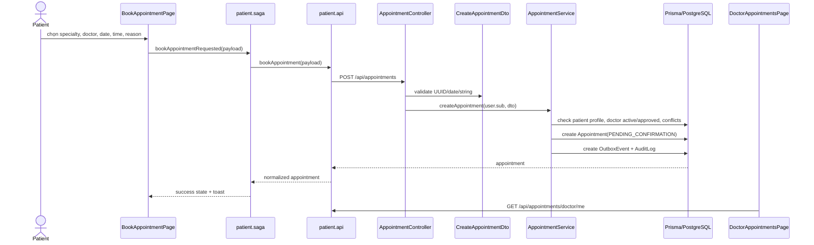

# Audit flow Appointment

Graphify query đã dùng trước:

```bash
graphify query "Trace appointment booking flow across frontend and backend" --graph graphify-out/graph.json --budget 3500
```

Graphify chỉ ra các node liên quan: `BookAppointmentPage.tsx`, `patient.api.ts`, `AppointmentService`, `appointment.controller.ts`, `PatientAppointmentPage`, và Redux state liên quan appointment. Kết luận dưới đây được xác minh trực tiếp từ source code.

## Trạng thái hiện tại

**Status: PARTIAL**

Flow appointment đã có create/list/detail/cancel, doctor confirm/complete/reschedule, admin list/update status, check conflict, transaction isolation, audit log và outbox notification. Gap chính là availability thật của doctor: FE dùng time slot hard-code, còn BE chỉ check overlap và doctor active/approved, chưa verify `scheduledAt` nằm trong `DoctorProfile.schedule`.

## Luồng end-to-end



## Bằng chứng frontend

| Layer | Evidence |
| --- | --- |
| Route | `ROUTE_PATHS.BOOK_APPOINTMENT = /patient/book-appointment`; route được bảo vệ bởi `AuthGuard` và `RoleGuard roles={['PATIENT']}` trong `OnlineHealthConsultation-Web/src/app/routes.tsx`. |
| Page/Form | `BookAppointmentPage` load specialty, load doctor theo specialty, ghép date/time thành ISO `scheduledAt`, rồi dispatch `bookAppointmentRequested` (`BookAppointmentPage.tsx:73`, `:105`, `:111`, `:172`). |
| Time slots | `timeSlots` hard-code trong `BookAppointmentPage.tsx:36`, không lấy từ doctor availability. |
| API client | `bookAppointment()` gọi `POST /appointments` với `{ doctorId, scheduledAt, durationMinutes?, reason, notes? }` (`patient.api.ts:94`, `:101`). |
| Redux flow | `handleBookAppointment` gọi `patientApi.bookAppointment`, dispatch success/fail và toast (`patient.saga.ts:48`). |
| Patient history | `getHistory()` gọi `/questions/mine`, `/appointments/mine`, `/ratings/mine`; history page hỗ trợ cancel/detail/result/rating (`patient.api.ts:105`, `ConsultationHistoryPage.tsx:51`, `:184`, `:199`). |
| Doctor UI | `DoctorAppointmentsPage` list appointment, confirm pending, complete confirmed, reschedule pending/confirmed, mở consultation cho confirmed/completed (`DoctorAppointmentsPage.tsx:36`, `:40`, `:174`, `:188`). |

## Bằng chứng backend

| Layer | Evidence |
| --- | --- |
| Controller | `AppointmentController` có `POST /appointments`, `GET /appointments/mine`, `PATCH /appointments/:id/cancel`, `GET /appointments/doctor/me`, `GET /appointments/:id`, `PATCH /appointments/:id/confirm`, `PATCH /appointments/:id/complete`, `PATCH /appointments/:id/reschedule` (`appointment.controller.ts:23`, `:30`, `:37`, `:44`, `:51`, `:61`, `:68`, `:75`). |
| Admin controller | `AdminAppointmentController` có `GET /admin/appointments`, `PATCH /admin/appointments/:id/status` (`appointment.controller.ts:90`, `:100`). |
| Authorization | Controller dùng `JwtAuthGuard` + `RolesGuard`; booking/list/cancel là patient-only; doctor actions là doctor-only; detail cho patient/doctor/admin; admin routes là admin-only. |
| DTO validation | `CreateAppointmentDto` validate `doctorId` UUID, `scheduledAt` date string, optional `durationMinutes` int min 15, required `reason` (`create-appointment.dto.ts:4`). |
| Service validation | `createAppointment` check patient profile, doctor tồn tại, `isActive`, `approvalStatus === APPROVED`, doctor user active, date hợp lệ (`appointment.service.ts:99`, `:105`, `:110`, `:114`). |
| Conflict prevention | Conflict statuses là `PENDING_CONFIRMATION`, `CONFIRMED`; service check overlap cho cả doctor và patient (`appointment.service.ts:20`, `:126`, `:138`, `:147`, `:154`, `:158`). |
| Persistence | Appointment được tạo với `PENDING_CONFIRMATION`, reason, notes, duration, patient, doctor (`appointment.service.ts:166`). |
| Consistency | Create dùng Prisma transaction với `Serializable` isolation (`appointment.service.ts:205`). |
| Notification/audit | Create ghi `OutboxEvent` và `AuditLog` (`appointment.service.ts:175`, `:189`). Confirm/reschedule cũng ghi outbox/audit (`appointment.service.ts:394`, `:409`, `:553`). |
| Database | `Appointment` model lưu `patientId`, `doctorId`, `scheduledAt`, `durationMinutes`, `status`, `reason`, `notes`, timestamps và indexes (`schema.prisma:274`). |

## Contract request/response

| Hướng | Contract |
| --- | --- |
| FE request | `POST /api/appointments` với `{ doctorId: string, scheduledAt: ISO string, reason: string, notes?: string, durationMinutes?: number }`. |
| BE response | Raw appointment record; FE normalize status/display fields trong `normalizeAppointment()` (`patient.api.ts:24`). |
| Status mapping | FE map `PENDING_CONFIRMATION` thành `pending`; doctor API cũng map backend status sang UI status (`doctor.api.ts:14`). |

## Business rule

| Rule | Status | Evidence |
| --- | --- | --- |
| Patient phải authenticated và có patient profile. | COMPLETED | Patient role + `patientProfile.findUnique({ where: { userId } })`. |
| Doctor phải active và approved. | COMPLETED | Điều kiện block doctor không available trong `createAppointment`. |
| Không double-book doctor. | COMPLETED | Overlap check theo doctor appointments trong conflict statuses. |
| Không double-book patient. | COMPLETED | Overlap check theo patient appointments trong conflict statuses. |
| Initial status khi book. | COMPLETED | Tạo `PENDING_CONFIRMATION`. |
| Doctor confirm/complete. | COMPLETED | `confirmAppointment`, `completeAppointment`. |
| Patient cancel own appointment. | COMPLETED | `cancelAppointment` check ownership và block cancelled/completed. |
| Doctor reschedule pending/confirmed. | COMPLETED | `rescheduleAppointment` check ownership/status/future time/conflicts. |
| Patient chỉ book slot thuộc doctor schedule. | PARTIAL | Backend check conflict nhưng không so `scheduledAt` với `DoctorProfile.schedule`; FE hard-code `timeSlots`. |
| File attachment khi booking. | NOT_IMPLEMENTED | SRS nói "nếu được hỗ trợ"; schema có `FileAttachment`, nhưng booking DTO/page không có upload. |

## Gap và issue

| Severity | Issue | Evidence | Impact |
| --- | --- | --- | --- |
| High | Chưa enforce doctor availability schedule khi booking. | `DoctorProfile.schedule` tồn tại, doctor update được schedule, nhưng `createAppointment` chỉ check conflict. | Patient có thể book thời điểm ngoài lịch làm việc doctor khai báo. |
| Medium | Booking page hard-code time slot. | `timeSlots` trong `BookAppointmentPage.tsx:36`. | UI có thể lệch với doctor schedule và backend availability. |
| Medium | Chưa có API lấy available slots theo doctor/date. | Không thấy endpoint trong `appointment.controller.ts` hoặc `discovery.controller.ts`. | FE không thể disable slot không khả dụng một cách chính xác. |
| Low | `AppointmentForm.tsx` là stub. | `OnlineHealthConsultation-Web/src/features/patient/components/AppointmentForm.tsx`. | Ít ảnh hưởng runtime vì form đang viết inline trong page, nhưng gây nhiễu codebase. |

## Task đề xuất

| Priority | Task |
| --- | --- |
| P0 | Thêm backend validation để requested appointment time nằm trong doctor schedule/availability. |
| P1 | Thêm availability endpoint, ví dụ `GET /public/doctors/:doctorId/availability?date=...`. |
| P1 | Thay hard-coded FE slots bằng available slots theo doctor/date. |
| P2 | Quyết định attachment khi booking có thuộc scope không; nếu có thì thêm upload contract và UI. |
