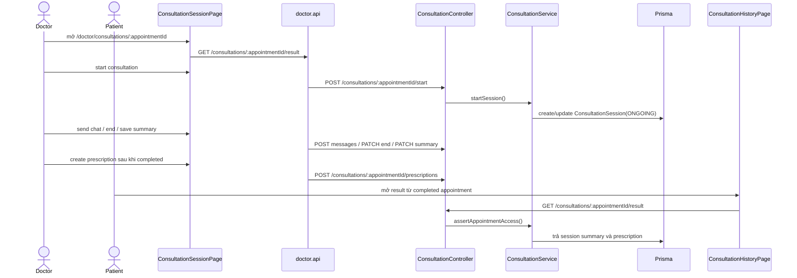

# Audit flow Consultation

Graphify query đã dùng trước:

```bash
graphify query "Trace consultation flow appointment consultation service prescription history frontend backend" --graph graphify-out/graph.json --budget 3500
```

Graphify xác định `ConsultationService` là node có độ kết nối cao và chỉ ra các file liên quan: `ConsultationSessionPage`, `ConsultationHistoryPage`, `doctor.api.ts`, `consultation.controller.ts`, các prescription DTO. Phần kết luận bên dưới được xác minh trực tiếp từ source code.

## Trạng thái hiện tại

**Status: PARTIAL**

Backend đã có nền tảng khá đầy đủ cho consultation/session/result/prescription/rating. Doctor UI có thể start session, chat qua REST, end session, save summary và tạo prescription. Patient UI có thể xem result/prescription từ appointment history và rating completed appointment. Các phần còn thiếu hoặc chưa hoàn chỉnh: chưa có patient live consultation page, WebSocket gateway có tồn tại nhưng frontend hiện dùng REST/reload thay vì Socket.IO, video chỉ có logic fallback ở backend và chưa có UI video/mock rõ ràng.

## Luồng end-to-end



## Bằng chứng backend

| Layer | Evidence |
| --- | --- |
| Controller | `ConsultationController` expose start, join, messages list/send, end, summary, prescription, result, patient history, doctor history (`consultation.controller.ts:25`, `:36`, `:46`, `:56`, `:67`, `:74`, `:85`, `:96`, `:106`, `:113`). |
| Ratings controller | `RatingController` expose patient create/list và doctor list; `AdminRatingController` moderate rating (`consultation.controller.ts:123`, `:128`, `:135`, `:142`, `:157`). |
| Startable status | `STARTABLE_APPOINTMENT_STATUSES` gồm `CONFIRMED` và `PENDING_CONFIRMATION` (`consultation.service.ts:23`). |
| Time window | `assertConsultationTimeWindow` check early/late join window từ env (`consultation.service.ts:51`). |
| Authorization | `assertAppointmentAccess` check ownership theo patient profile và doctor profile; admin được đi qua (`consultation.service.ts:80`, `:501`). |
| Start session | `startSession` check doctor ownership, status, time window, channel fallback, tạo/cập nhật `ConsultationSession`, và auto-confirm appointment pending (`consultation.service.ts:99`, `:111`, `:114`, `:116`, `:118`, `:131`). |
| Join/messages | `joinSession`, `listSessionMessages`, `sendSessionMessage` verify access và persist message (`consultation.service.ts:165`, `:196`, `:214`). |
| End session | `endSession` set consultation `COMPLETED` và appointment `COMPLETED` (`consultation.service.ts:245`). |
| Summary | `updateSummary` lưu `ConsultationSession.summary` (`consultation.service.ts:278`). |
| Prescription | `createPrescription` yêu cầu appointment completed, upsert prescription, replace prescription items (`consultation.service.ts:301`). |
| Result/history | `getConsultationResult`, `listMyConsultations`, `listDoctorConsultations` trả consultation/prescription history (`consultation.service.ts:457`, `:528`, `:566`). |
| WebSocket | `ConsultationGateway` authenticate Socket.IO client và hỗ trợ `consultation:join` / `consultation:message` (`consultation.gateway.ts:22`, `:56`, `:82`). |
| Database | Có `ConsultationSession`, `ConsultationMessage`, `Prescription`, `PrescriptionItem`, `Rating` models (`schema.prisma:297`, `:316`, `:334`, `:347`, `:364`). |

## Bằng chứng frontend

| Area | Evidence |
| --- | --- |
| Doctor route | `/doctor/consultations/:appointmentId` được protect cho role Doctor trong `routes.tsx`. |
| Entry từ doctor appointment | `DoctorAppointmentsPage` navigate tới `/doctor/consultations/${rowData.id}` cho confirmed/completed appointments (`DoctorAppointmentsPage.tsx:188`). |
| Doctor API | `doctor.api.ts` gọi `/consultations/:appointmentId/start`, `/join`, `/messages`, `/result`, `/messages`, `/end`, `/summary`, `/prescriptions` (`doctor.api.ts:251`-`:272`). |
| Doctor session page | `ConsultationSessionPage` load result, start session, send messages, end consultation, save summary, save prescription (`ConsultationSessionPage.tsx:89`, `:146`, `:282`, `:298`, `:328`, `:436`). |
| Patient result view | `ConsultationHistoryPage` mở consultation result dialog cho completed appointment và hiển thị summary/prescription items (`ConsultationHistoryPage.tsx:78`, `:184`, `:430`, `:447`). |
| Patient rating | Patient history dispatch `rateConsultationRequested`; API gọi `POST /ratings` (`ConsultationHistoryPage.tsx:100`; `patient.api.ts:142`). |

## Business rule

| Rule | Status | Evidence |
| --- | --- | --- |
| Consultation chỉ start cho valid appointment và responsible doctor. | COMPLETED | `startSession` check doctor profile và appointment doctor ownership. |
| Consultation có allowed time window. | COMPLETED | `assertConsultationTimeWindow` được gọi khi start/join. |
| Patient/doctor/admin result access bị giới hạn. | COMPLETED | `assertAppointmentAccess` trong result flow. |
| Chat messages được persist. | COMPLETED | `ConsultationMessage` model + `sendSessionMessage`. |
| Session summary được persist. | COMPLETED | `updateSummary` update `ConsultationSession.summary`. |
| Prescription gắn với completed consultation. | COMPLETED | `createPrescription` yêu cầu `appointment.status === COMPLETED`. |
| Patient xem own result/prescription. | COMPLETED | Patient result dialog gọi protected endpoint; backend enforce ownership. |
| Patient tham gia live consultation. | PARTIAL | Backend `joinSession` hỗ trợ patient, nhưng chưa thấy patient live session route/page. |
| Real-time chat ở frontend. | PARTIAL | Socket.IO gateway tồn tại; `ConsultationSessionPage` hiện dùng REST send/list và reload. |
| Video/mock consultation. | PARTIAL | Backend chọn VIDEO nếu `VIDEO_PROVIDER_ENABLED=true`, nếu không fallback CHAT; chưa thấy FE video/mock UI. |
| Doctor xem consultation history của patient. | PARTIAL | Backend có `GET /consultations/doctor/me`; chưa thấy UI doctor dùng rõ ràng. |

## Contract API

| API | Roles | Ghi chú |
| --- | --- | --- |
| `POST /api/consultations/:appointmentId/start` | Doctor | Start/resume session; có thể auto-confirm pending appointment. |
| `POST /api/consultations/:appointmentId/join` | Patient, Doctor, Admin | Cần session đã started và nằm trong time window. |
| `GET/POST /api/consultations/:appointmentId/messages` | Patient, Doctor, Admin | REST message list/send. |
| `PATCH /api/consultations/:appointmentId/end` | Doctor | Complete session và appointment. |
| `PATCH /api/consultations/:appointmentId/summary` | Doctor | Lưu clinical summary. |
| `POST /api/consultations/:appointmentId/prescriptions` | Doctor | Tạo/replace prescription items. |
| `GET /api/consultations/:appointmentId/result` | Patient, Doctor, Admin | Trả appointment, session summary, prescription. |
| `GET /api/consultations/mine` | Patient | Backend implemented; patient history hiện dùng appointment list + per-result fetch. |
| `GET /api/consultations/doctor/me` | Doctor | Backend implemented; chưa thấy surfaced rõ trong doctor UI. |

## Gap và issue

| Severity | Issue | Evidence | Impact |
| --- | --- | --- | --- |
| High | Chưa có patient live consultation page/route. | Routes chỉ expose doctor consultation page; patient history chỉ có result dialog. | UC-P-10 / CONS live participation chưa hoàn chỉnh ở phía patient. |
| Medium | Frontend chưa dùng WebSocket gateway. | Backend có `ConsultationGateway`, nhưng FE dùng REST trong `doctor.api.ts`. | Yêu cầu real-time chat mới đạt mức backend-capable, chưa đạt UX realtime đầy đủ. |
| Medium | Video support mới là backend fallback logic. | `requestedChannel === 'VIDEO' && VIDEO_PROVIDER_ENABLED`; FE start `{ channel: 'CHAT' }`. | Video/mock requirement vẫn PARTIAL. |
| Medium | Doctor có thể save summary khi session tồn tại, không nhất thiết sau khi end. | `handleSaveSummary` enabled khi có consultation, không chỉ completed. | Có thể chấp nhận được, nhưng khác cách diễn đạt trong SRS: "sau khi session kết thúc". |
| Low | Patient history chưa dùng `GET /consultations/mine`. | `getHistory()` gọi questions/appointments/ratings, không gọi consultations. | Logic history bị phân tán và có thể phải gọi result từng appointment. |

## Task đề xuất

| Priority | Task |
| --- | --- |
| P0 | Thêm patient consultation session route/page với join, chat, status handling. |
| P1 | Wire frontend chat sang Socket.IO hoặc ghi rõ MVP dùng persisted REST chat thay vì realtime. |
| P1 | Thêm video mock UI hoặc không claim video là completed trong MVP. |
| P2 | Dùng `GET /consultations/mine` cho patient consultation history hoặc bỏ endpoint khỏi planned contract. |
| P2 | Chốt business rule summary được edit ở trạng thái ongoing, completed, hay cả hai. |
