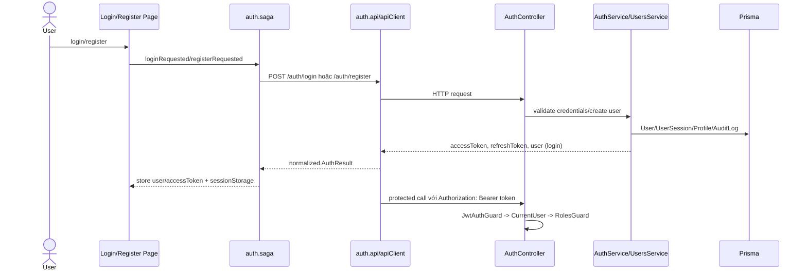

# Audit Authentication và RBAC

Graphify query đã dùng trước:

```bash
graphify query "Trace authentication RBAC JWT CurrentUser Roles guards frontend routes" --graph graphify-out/graph.json --budget 3500
```

Graphify xác định `Roles()`, `CurrentUser`, `JwtAuthGuard`, `routes.tsx`, `AuthGuard`, `RoleGuard`, `apiClient`, `refreshManager` là các node trung tâm. Phần bên dưới được xác minh trực tiếp từ source code.

## Trạng thái hiện tại

**Status: PARTIAL**

Core JWT authentication, refresh rotation/session tracking, backend role guards, frontend route guards, password hashing, logout và một số ownership check đã được implement. Tuy nhiên password reset mới có token generation/storage, chưa có email delivery thật. Ngoài ra contract refresh token đang lệch: frontend `refreshManager` gửi body rỗng và kỳ vọng httpOnly cookie, trong khi backend `AuthController.refresh` nhận `RefreshTokenDto` từ body.

## Trace auth flow



## Bằng chứng backend

| Layer | Evidence |
| --- | --- |
| Auth endpoints | `AuthController` expose `POST /auth/register`, `/login`, `/refresh`, `/forgot-password`, `/reset-password`, `/logout`, `GET /auth/me` (`auth.controller.ts:40`, `:51`, `:63`, `:74`, `:81`, `:90`, `:128`). |
| Login | `AuthService.login` check user tồn tại, bcrypt password match, account active/deleted, issue session tokens, ghi login audit log (`auth.service.ts:39`). |
| Refresh rotation | `AuthService.refresh` verify refresh JWT, match hashed token trong `UserSession`, revoke old session, issue token mới, ghi audit log (`auth.service.ts:62`). |
| Logout | `logout` revoke active sessions của user và ghi audit log (`auth.service.ts:109`). |
| Password reset | `forgotPassword` tạo hashed reset token và audit log; `resetPassword` validate token, update bcrypt hash, mark token used, revoke sessions (`auth.service.ts:120`, `:147`). |
| Password hashing | `UsersService.createUserCore` dùng bcrypt salt/hash trước khi create user (`users.service.ts:40`). |
| Role decorator | `Roles()` set required roles metadata (`roles.decorator.ts:5`). |
| Current user | `CurrentUser` decorator trả `request.user` (`current-user.decorator.ts:3`). |
| JWT guard | `JwtAuthGuard` extends Passport JWT strategy (`jwt-auth.guard.ts:5`). |
| Roles guard | `RolesGuard` đọc roles metadata và check `request.user.role` (`roles.guard.ts:7`). |
| Ownership guard | `GET /auth/users/:userId` dùng `OwnershipGuard` với admin override (`auth.controller.ts:98`). |
| Admin user management | `AdminUserController` được guard bởi JWT/Roles và `@Roles(Role.ADMIN)` (`admin-user.controller.ts:17`). |

## Bằng chứng frontend

| Layer | Evidence |
| --- | --- |
| Login/register API | `auth.api.ts` gọi `POST /auth/login` và `POST /auth/register`; login kỳ vọng token và user (`auth.api.ts:54`, `:70`). |
| Logout/me/refresh API | `auth.api.ts` gọi `POST /auth/logout`, `GET /auth/me`, và `performRefresh()` (`auth.api.ts:79`, `:83`, `:104`). |
| Saga | `auth.saga.ts` xử lý login/register/logout/me; login persist access token, register cố ý không authenticate ngay (`auth.saga.ts:20`, `:43`, `:68`, `:82`). |
| Request auth header | `apiClient` inject `Authorization: Bearer ${accessToken}` từ Redux state (`apiClient.ts:16`). |
| 401 retry | `apiClient` gọi `performRefresh` một lần cho non-auth 401 responses (`apiClient.ts:30`). |
| Refresh manager | `refreshManager` gọi `${BASE_URL}/auth/refresh` với body `{}` và `withCredentials: true` (`refreshManager.ts:71`). |
| Frontend protected routes | `AuthGuard` redirect unauthenticated user về `/login` và lưu `returnUrl` (`AuthGuard.tsx:10`). |
| Frontend role routes | `RoleGuard` redirect user không đủ role về `/403` (`RoleGuard.tsx:11`). |
| Route map | Patient, doctor, admin routes được wrap bằng `RoleGuard` trong `routes.tsx`. |

## Coverage authorization

| Area | Backend | Frontend | Status |
| --- | --- | --- | --- |
| Public pages | Public controller không có auth guard. | Home/specialties/doctors/detail nằm ngoài `AuthGuard`. | COMPLETED |
| Patient appointment/question/profile | `@Roles(Role.PATIENT)`. | Patient routes dùng `RoleGuard roles={['PATIENT']}`. | COMPLETED |
| Doctor profile/schedule/questions/appointments/consultation | Doctor actions dùng `@Roles(Role.DOCTOR)`. | Doctor routes dùng `RoleGuard roles={['DOCTOR']}`. | COMPLETED |
| Admin users/doctors/specialties/appointments/reports/moderation | Admin controllers dùng `@Roles(Role.ADMIN)`. | Admin routes dùng `RoleGuard roles={['ADMIN']}`; reports route cho admin/doctor nhưng backend reports là admin-only. | PARTIAL |
| Data ownership | Appointment/consultation services verify patient/doctor profile ownership. | FE ẩn route theo role, backend vẫn là lớp authoritative. | COMPLETED |

## Security concern

| Severity | Concern | Evidence | Impact |
| --- | --- | --- | --- |
| High | Refresh token contract mismatch. | Backend `POST /auth/refresh` nhận `RefreshTokenDto`; frontend gửi `{}` với cookies trong `refreshManager.ts:71`. | Silent refresh có thể fail nếu không có cookie mechanism khác ngoài code đã xem. |
| High | Password reset chưa gửi token qua email. | `forgotPassword` tạo `plainToken` nhưng response không trả token và không tạo notification/email outbox. | AUTH-06 mới là backend-token partial, chưa usable với user. |
| Medium | Reports route mismatch. | FE cho `ADMIN` và `DOCTOR` vào `/reports`; backend `ReportingController` là `@Roles(Role.ADMIN)`. | Doctor mở reports có thể nhận 403. |
| Medium | JWT secrets có dev fallback. | `JWT_REFRESH_SECRET ?? 'refresh-secret-dev'`, gateway dùng `JWT_SECRET || 'super-secret-key-for-dev'`. | Chấp nhận local, rủi ro nếu production env validation không chặn default. |
| Medium | WebSocket auth tự verify JWT bằng `jsonwebtoken` và env fallback. | `ConsultationGateway.handleConnection`. | Dễ drift với HTTP auth policy. |
| Low | Frontend lưu access token trong sessionStorage. | `auth.saga.ts` gọi `saveAuthToStorage`. | Có rủi ro XSS; cần giảm bằng token lifetime/ngăn XSS. |

## Graphify import cycle warning

`GRAPH_REPORT.md` báo nhiều frontend import cycles quanh:

- `apiClient.ts -> store.ts -> rootSaga.ts -> auth.saga.ts -> auth.api.ts -> apiClient.ts`
- `refreshManager.ts -> store.ts -> rootSaga.ts -> auth.saga.ts -> refreshManager.ts`
- Các cycle tương tự qua admin/reports/doctor/patient sagas và APIs.

Đối chiếu source thấy cảnh báo này hợp lý:

- `apiClient.ts` import `store` để đọc access token và dispatch logout.
- `refreshManager.ts` import `store` để dispatch `setAccessToken`.
- `store.ts/rootSaga.ts` import sagas, còn sagas import API modules.

Impact: import cycle có thể gây initialization-order fragility và làm API/client code phụ thuộc global Redux store. Hướng cải thiện là dependency inversion: giữ Axios client pure, inject token getter/logout handler ở app bootstrap, hoặc chuyển refresh orchestration sang middleware để API modules không import vòng qua store.

## Task đề xuất

| Priority | Task |
| --- | --- |
| P0 | Align refresh-token contract: backend đọc/set httpOnly refresh cookie hoặc frontend gửi `refreshToken` body nhất quán. |
| P1 | Implement forgot-password delivery qua notification/email outbox hoặc document secure equivalent. |
| P1 | Sửa mismatch authorization route `/reports` giữa FE và BE. |
| P2 | Gỡ store/API import cycles bằng cách decouple `apiClient`/`refreshManager` khỏi direct store imports. |
| P2 | Chuẩn hóa WebSocket JWT verification qua shared auth config/strategy. |
