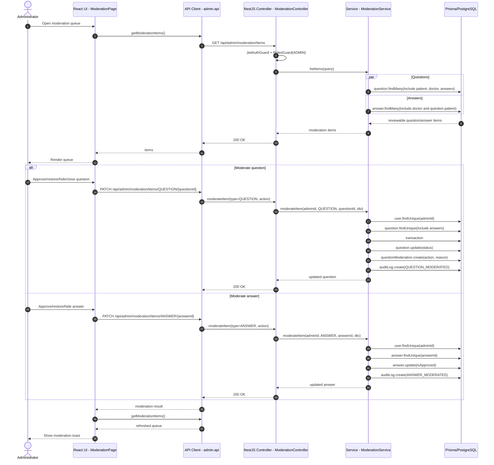

## 6. Moderate Health Question/Response

Questions and answers are loaded through the unified moderation list. Question moderation updates question status and creates `QuestionModeration`; answer moderation toggles `Answer.isApproved`.

