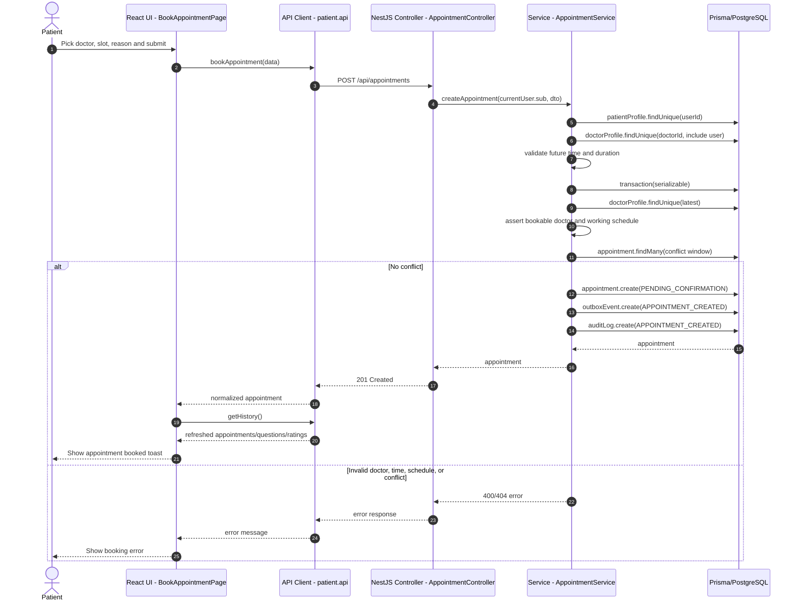

## 6. Book Appointment

Patient đặt lịch qua `POST /api/appointments`. Service kiểm tra patient, doctor, thời gian tương lai, lịch làm việc, conflict của doctor/patient rồi tạo appointment, outbox event và audit log trong transaction serializable.

