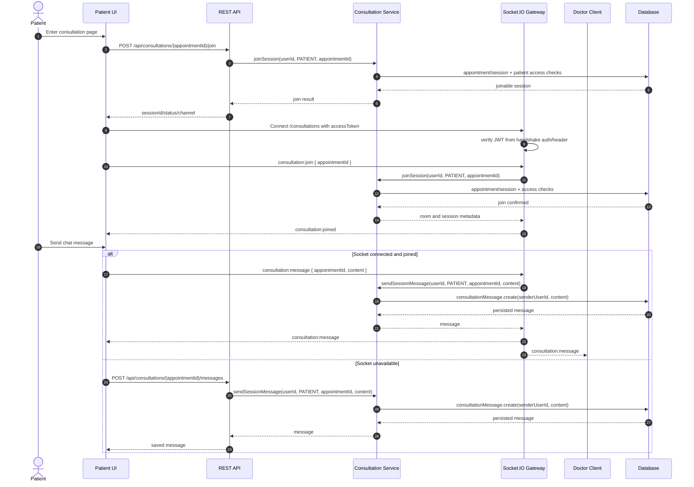

## 10. Realtime Chat

Realtime consultation dùng REST để join/load fallback, và Socket.IO namespace `/consultations` để join room và broadcast message. Nếu socket chưa sẵn sàng, UI fallback sang REST `POST /messages`.

