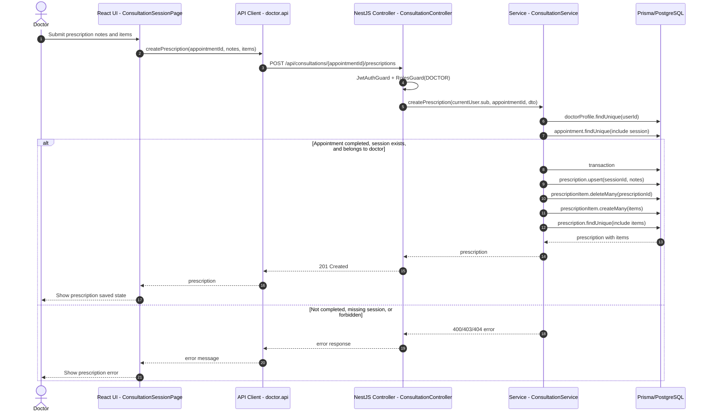

## 13. Create Prescription

Doctor creates or replaces prescription through `POST /api/consultations/{appointmentId}/prescriptions`. Implementation requires appointment status `COMPLETED`.

```mermaid
sequenceDiagram
  autonumber
  actor Doctor
  participant UI as React UI - ConsultationSessionPage
  participant API as API Client - doctor.api
  participant Controller as NestJS Controller - ConsultationController
  participant Service as Service - ConsultationService
  participant DB as Prisma/PostgreSQL

  Doctor->>UI: Submit prescription notes and items
  UI->>API: createPrescription(appointmentId, notes, items)
  API->>Controller: POST /api/consultations/{appointmentId}/prescriptions
  Controller->>Controller: JwtAuthGuard + RolesGuard(DOCTOR)
  Controller->>Service: createPrescription(currentUser.sub, appointmentId, dto)
  Service->>DB: doctorProfile.findUnique(userId)
  Service->>DB: appointment.findUnique(include session)
  alt Appointment completed, session exists, and belongs to doctor
    Service->>DB: transaction
    Service->>DB: prescription.upsert(sessionId, notes)
    Service->>DB: prescriptionItem.deleteMany(prescriptionId)
    Service->>DB: prescriptionItem.createMany(items)
    Service->>DB: prescription.findUnique(include items)
    DB-->>Service: prescription with items
    Service-->>Controller: prescription
    Controller-->>API: 201 Created
    API-->>UI: prescription
    UI-->>Doctor: Show prescription saved state
  else Not completed, missing session, or forbidden
    Service-->>Controller: 400/403/404 error
    Controller-->>API: error response
    API-->>UI: error message
    UI-->>Doctor: Show prescription error
  end
```
