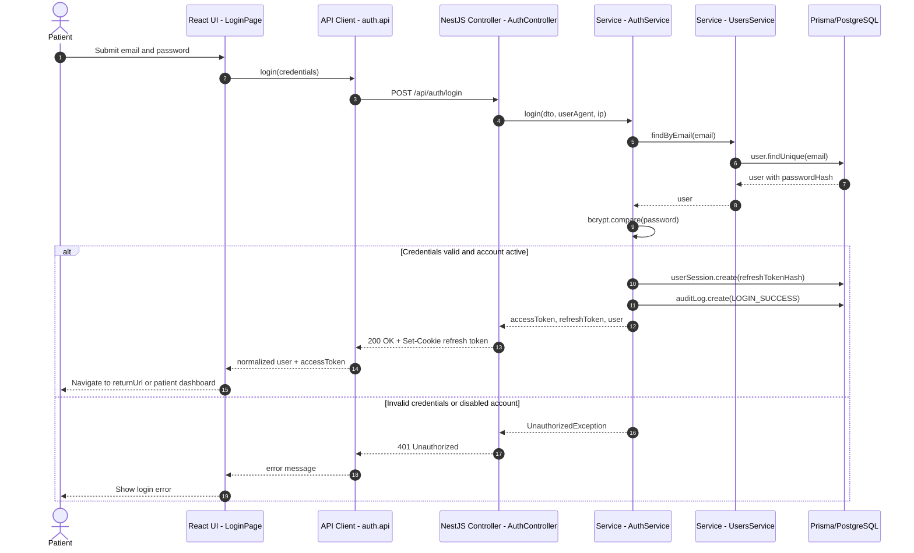

## 2. Login

Luồng đăng nhập gọi `POST /api/auth/login`. Backend xác thực mật khẩu, tạo `UserSession`, trả access token và set HttpOnly refresh cookie.

```mermaid
sequenceDiagram
  autonumber
  actor Patient
  participant UI as React UI - LoginPage
  participant API as API Client - auth.api
  participant Controller as NestJS Controller - AuthController
  participant Auth as Service - AuthService
  participant Users as Service - UsersService
  participant DB as Prisma/PostgreSQL

  Patient->>UI: Submit email and password
  UI->>API: login(credentials)
  API->>Controller: POST /api/auth/login
  Controller->>Auth: login(dto, userAgent, ip)
  Auth->>Users: findByEmail(email)
  Users->>DB: user.findUnique(email)
  DB-->>Users: user with passwordHash
  Users-->>Auth: user
  Auth->>Auth: bcrypt.compare(password)
  alt Credentials valid and account active
    Auth->>DB: userSession.create(refreshTokenHash)
    Auth->>DB: auditLog.create(LOGIN_SUCCESS)
    Auth-->>Controller: accessToken, refreshToken, user
    Controller-->>API: 200 OK + Set-Cookie refresh token
    API-->>UI: normalized user + accessToken
    UI-->>Patient: Navigate to returnUrl or patient dashboard
  else Invalid credentials or disabled account
    Auth-->>Controller: UnauthorizedException
    Controller-->>API: 401 Unauthorized
    API-->>UI: error message
    UI-->>Patient: Show login error
  end
```
