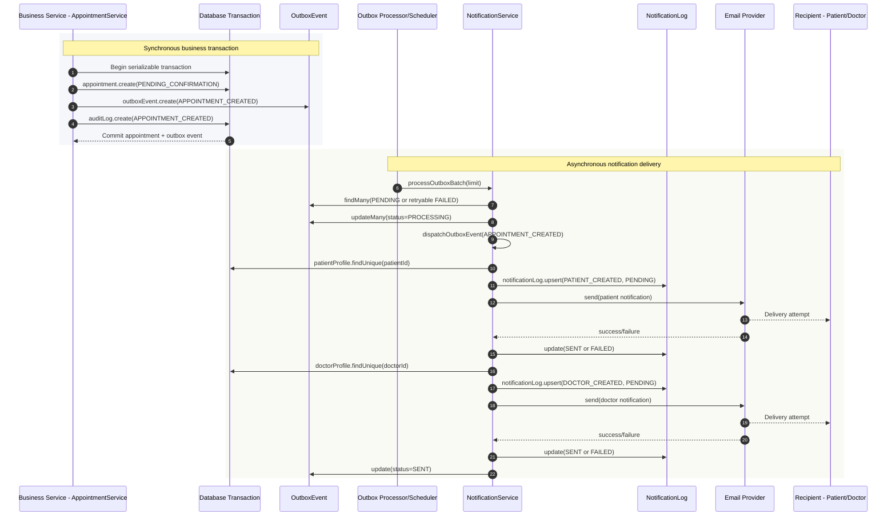

## 1. Appointment Created Notification

`AppointmentService.createAppointment()` tạo appointment, outbox event và audit log trong cùng transaction. Delivery diễn ra sau đó bởi scheduler.

```mermaid
sequenceDiagram
  autonumber
  participant Business as Business Service - AppointmentService
  participant Tx as Database Transaction
  participant Outbox as OutboxEvent
  participant Scheduler as Outbox Processor/Scheduler
  participant Notify as NotificationService
  participant Log as NotificationLog
  participant Email as Email Provider
  participant Recipient as Recipient - Patient/Doctor

  rect rgb(245, 247, 250)
    Note over Business,Outbox: Synchronous business transaction
    Business->>Tx: Begin serializable transaction
    Business->>Tx: appointment.create(PENDING_CONFIRMATION)
    Business->>Outbox: outboxEvent.create(APPOINTMENT_CREATED)
    Business->>Tx: auditLog.create(APPOINTMENT_CREATED)
    Tx-->>Business: Commit appointment + outbox event
  end

  rect rgb(250, 250, 245)
    Note over Scheduler,Recipient: Asynchronous notification delivery
    Scheduler->>Notify: processOutboxBatch(limit)
    Notify->>Outbox: findMany(PENDING or retryable FAILED)
    Notify->>Outbox: updateMany(status=PROCESSING)
    Notify->>Notify: dispatchOutboxEvent(APPOINTMENT_CREATED)
    Notify->>Tx: patientProfile.findUnique(patientId)
    Notify->>Log: notificationLog.upsert(PATIENT_CREATED, PENDING)
    Notify->>Email: send(patient notification)
    Email-->>Recipient: Delivery attempt
    Email-->>Notify: success/failure
    Notify->>Log: update(SENT or FAILED)
    Notify->>Tx: doctorProfile.findUnique(doctorId)
    Notify->>Log: notificationLog.upsert(DOCTOR_CREATED, PENDING)
    Notify->>Email: send(doctor notification)
    Email-->>Recipient: Delivery attempt
    Email-->>Notify: success/failure
    Notify->>Log: update(SENT or FAILED)
    Notify->>Outbox: update(status=SENT)
  end
```
