# Prompt vẽ 15 hình báo cáo giữa kỳ

**Mermaid** → paste vào [mermaid.live](https://mermaid.live) → tải PNG  
**PlantUML** → paste vào [plantuml.com](https://www.plantuml.com/plantuml/form) → Generate PNG  
**draw.io** → Extras → Edit Diagram → paste Mermaid code

---

## Hình 1 — Quy trình nghiệp vụ tổng quan

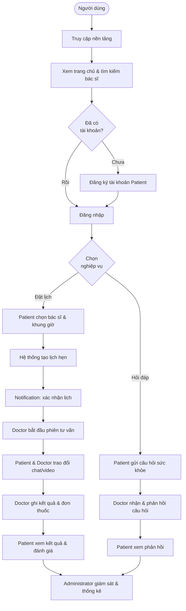

---

## Hình 2 — Use case tổng quan toàn hệ thống

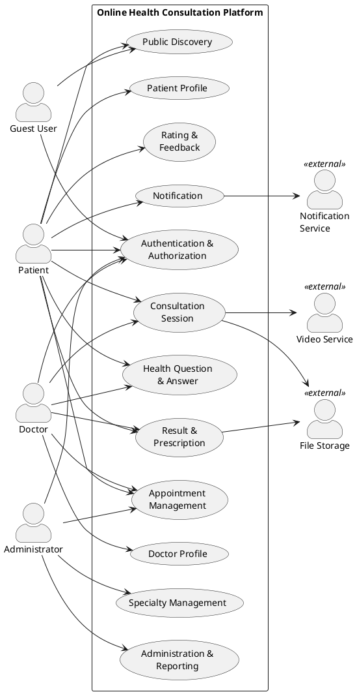

---

## Hình 3 — Use case diagram nhóm Guest User

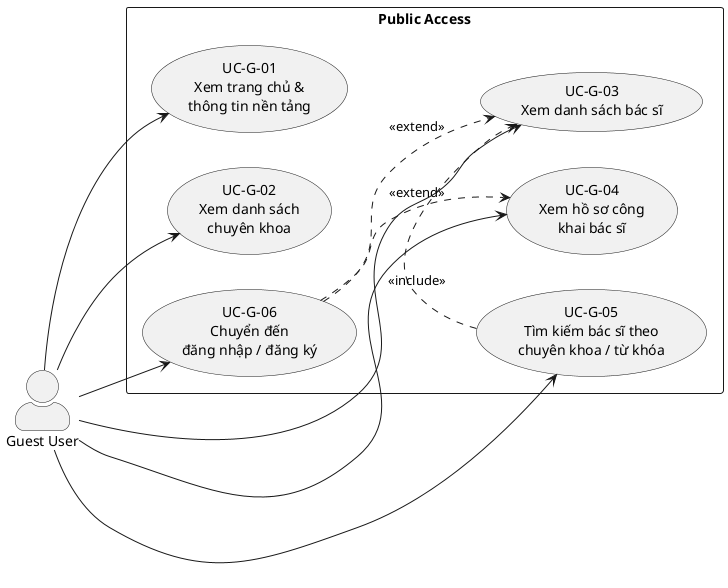

---

## Hình 4 — Use case diagram nhóm Patient

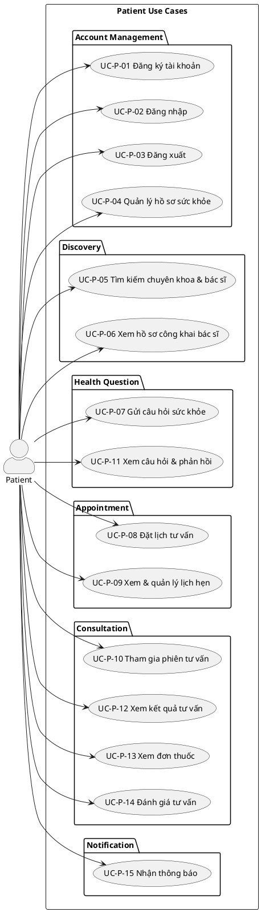

---

## Hình 5 — Use case diagram nhóm Doctor

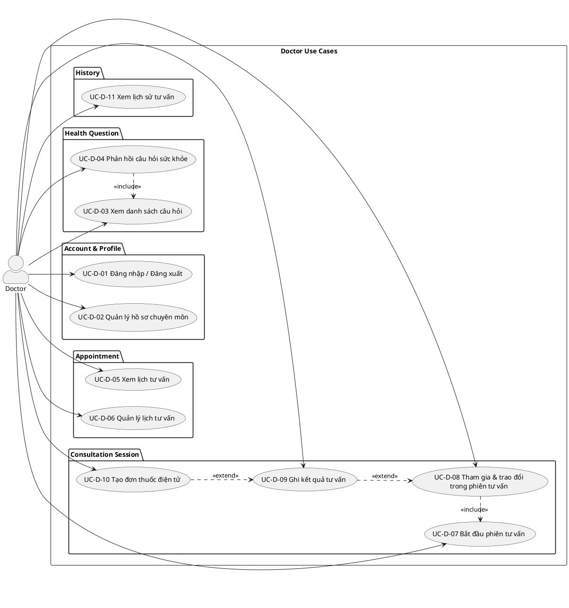

---

## Hình 6 — Use case diagram nhóm Administrator

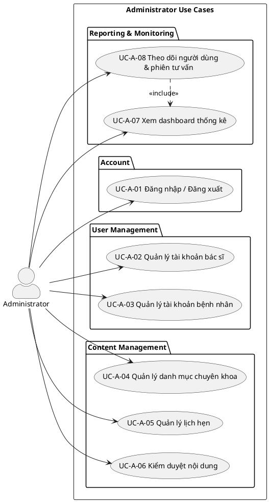

---

## Hình 7 — Activity: Guest User tra cứu bác sĩ

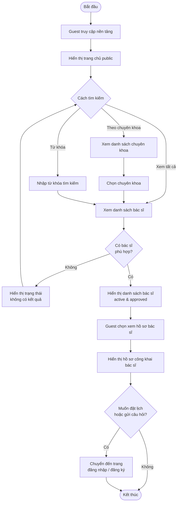

---

## Hình 8 — Activity: Patient đăng ký / đăng nhập

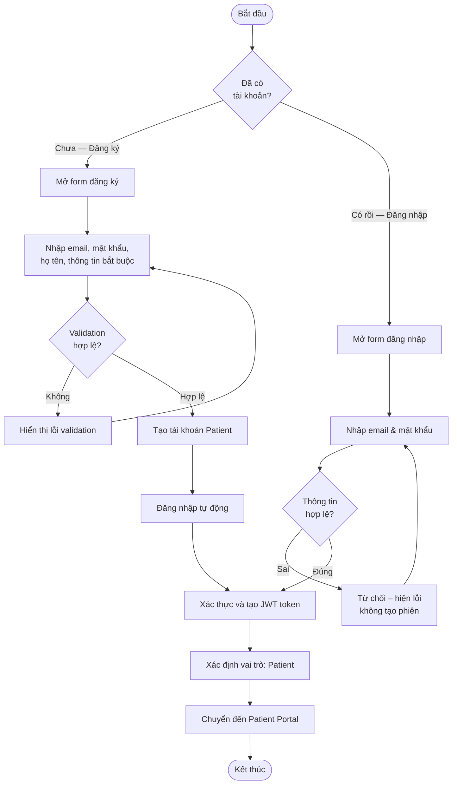

---

## Hình 9 — Activity: Patient đặt lịch tư vấn

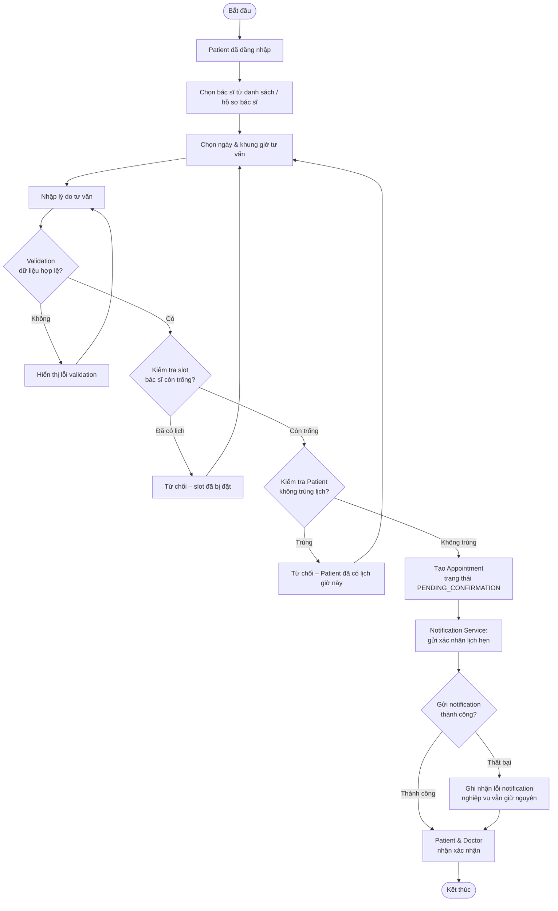

---

## Hình 10 — Activity: Patient gửi câu hỏi sức khỏe

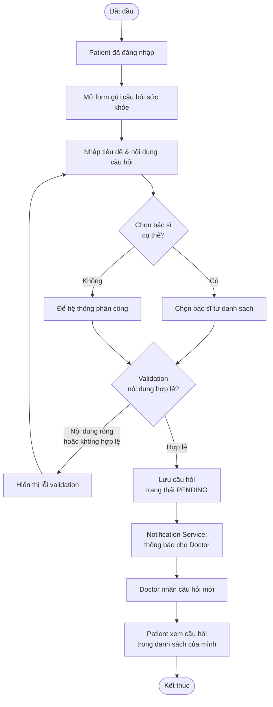

---

## Hình 11 — Activity: Doctor phản hồi câu hỏi

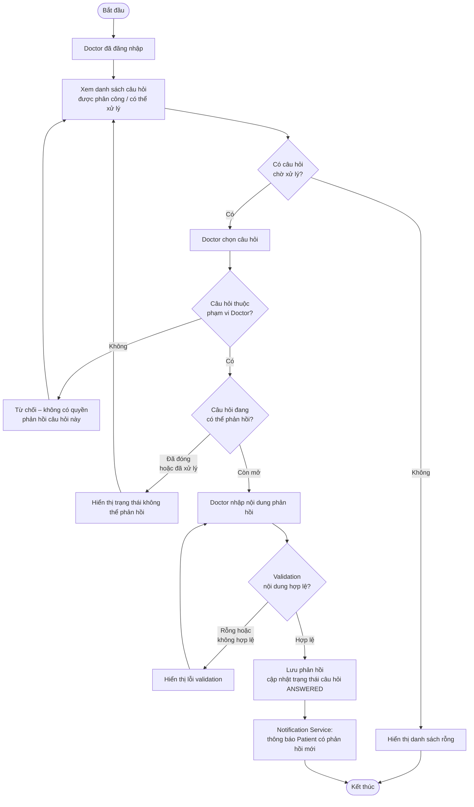

---

## Hình 12 — Activity: Doctor thực hiện phiên tư vấn

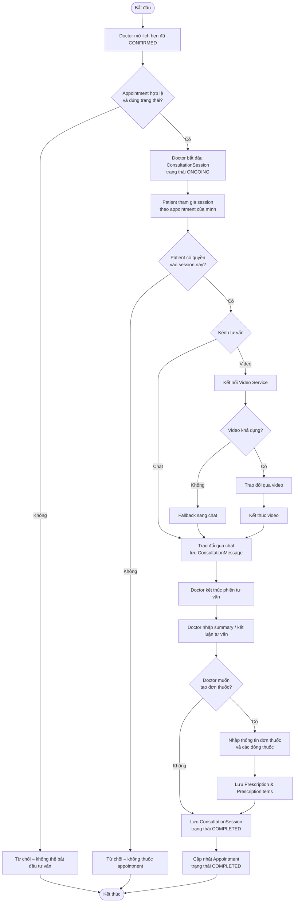

---

## Hình 13 — Activity: Administrator quản lý hệ thống

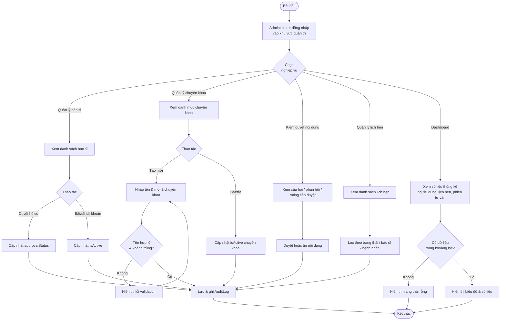

---

## Hình 14 — Kiến trúc hệ thống

> Dựa trên project thực: NestJS modules, WebSocket Gateway, Prisma ORM, PostgreSQL, external services.

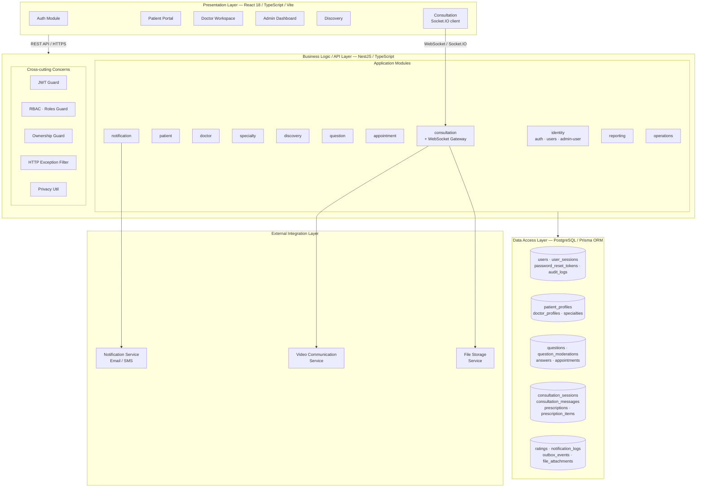

---

## Hình 15 — ERD / Database diagram

> Dựa trên `prisma/schema.prisma` thực của project.

```mermaid
erDiagram
    users {
        uuid id PK
        string email UK
        string passwordHash
        string firstName
        string lastName
        enum role
        boolean isActive
        datetime deletedAt
        datetime createdAt
        datetime updatedAt
    }
    user_sessions {
        uuid id PK
        uuid userId FK
        string refreshTokenHash UK
        datetime expiresAt
        datetime revokedAt
        datetime rotatedAt
        datetime lastUsedAt
        string userAgent
        string ipAddress
        datetime createdAt
    }
    password_reset_tokens {
        uuid id PK
        uuid userId FK
        string tokenHash UK
        datetime expiresAt
        datetime usedAt
        datetime createdAt
    }
    audit_logs {
        uuid id PK
        uuid actorUserId FK
        string action
        string resource
        string resourceId
        string ipAddress
        string userAgent
        json metadata
        datetime createdAt
    }
    patient_profiles {
        uuid id PK
        uuid userId FK_UK
        date dateOfBirth
        enum gender
        string phone
        string address
        string medicalHistory
        datetime createdAt
        datetime updatedAt
    }
    doctor_profiles {
        uuid id PK
        uuid userId FK_UK
        string bio
        int yearsOfExperience
        enum approvalStatus
        boolean isActive
        json schedule
        datetime scheduleUpdatedAt
        datetime createdAt
        datetime updatedAt
    }
    specialties {
        uuid id PK
        string nameEn UK
        string nameVi
        string description
        boolean isActive
        datetime createdAt
        datetime updatedAt
    }
    doctor_specialties {
        uuid id PK
        uuid doctorId FK
        uuid specialtyId FK
        datetime createdAt
    }
    questions {
        uuid id PK
        uuid patientId FK
        uuid doctorId FK
        string title
        string content
        enum status
        datetime createdAt
        datetime updatedAt
    }
    question_moderations {
        uuid id PK
        uuid questionId FK
        uuid adminUserId FK
        string action
        string reason
        datetime createdAt
    }
    answers {
        uuid id PK
        uuid questionId FK
        uuid doctorId FK
        string content
        boolean isApproved
        datetime createdAt
        datetime updatedAt
    }
    appointments {
        uuid id PK
        uuid patientId FK
        uuid doctorId FK
        datetime scheduledAt
        int durationMinutes
        enum status
        string reason
        string notes
        datetime createdAt
        datetime updatedAt
    }
    consultation_sessions {
        uuid id PK
        uuid appointmentId FK_UK
        enum status
        datetime startedAt
        datetime endedAt
        string summary
        string channel
        datetime createdAt
        datetime updatedAt
    }
    consultation_messages {
        uuid id PK
        uuid consultationSessionId FK
        uuid senderUserId FK
        string content
        string messageType
        datetime createdAt
        datetime updatedAt
    }
    prescriptions {
        uuid id PK
        uuid sessionId FK_UK
        string notes
        datetime createdAt
        datetime updatedAt
    }
    prescription_items {
        uuid id PK
        uuid prescriptionId FK
        string medicationName
        string dosage
        string frequency
        string duration
        string notes
        datetime createdAt
        datetime updatedAt
    }
    ratings {
        uuid id PK
        uuid patientId FK
        uuid doctorId FK
        uuid appointmentId FK_UK
        int score
        string comment
        enum status
        datetime createdAt
        datetime updatedAt
    }
    notification_logs {
        uuid id PK
        uuid userId FK
        enum type
        string content
        string externalRef UK
        enum status
        string provider
        string errorCode
        string errorMsg
        datetime createdAt
        datetime updatedAt
    }
    outbox_events {
        uuid id PK
        string aggregateType
        string aggregateId
        string eventType
        json payload
        enum status
        int retryCount
        datetime nextRetryAt
        datetime createdAt
        datetime updatedAt
    }
    file_attachments {
        uuid id PK
        string ownerType
        string ownerId
        uuid consultationSessionId FK
        string storageKey
        string mimeType
        int sizeBytes
        uuid uploadedByUserId FK
        datetime createdAt
    }

    users ||--o{ user_sessions : "has"
    users ||--o{ password_reset_tokens : "has"
    users ||--o| patient_profiles : "has"
    users ||--o| doctor_profiles : "has"
    users ||--o{ audit_logs : "creates"
    users ||--o{ notification_logs : "receives"
    users ||--o{ question_moderations : "moderates"
    doctor_profiles ||--o{ doctor_specialties : "has"
    specialties ||--o{ doctor_specialties : "linked"
    patient_profiles ||--o{ questions : "asks"
    doctor_profiles ||--o{ questions : "assigned"
    questions ||--o{ answers : "has"
    questions ||--o{ question_moderations : "moderated by"
    doctor_profiles ||--o{ answers : "gives"
    patient_profiles ||--o{ appointments : "books"
    doctor_profiles ||--o{ appointments : "receives"
    appointments ||--o| consultation_sessions : "has"
    consultation_sessions ||--o{ consultation_messages : "contains"
    consultation_sessions ||--o| prescriptions : "has"
    prescriptions ||--o{ prescription_items : "contains"
    patient_profiles ||--o{ ratings : "gives"
    doctor_profiles ||--o{ ratings : "receives"
    appointments ||--o| ratings : "rated by"
    consultation_sessions ||--o{ file_attachments : "has"
    users ||--o{ file_attachments : "uploads"
```
